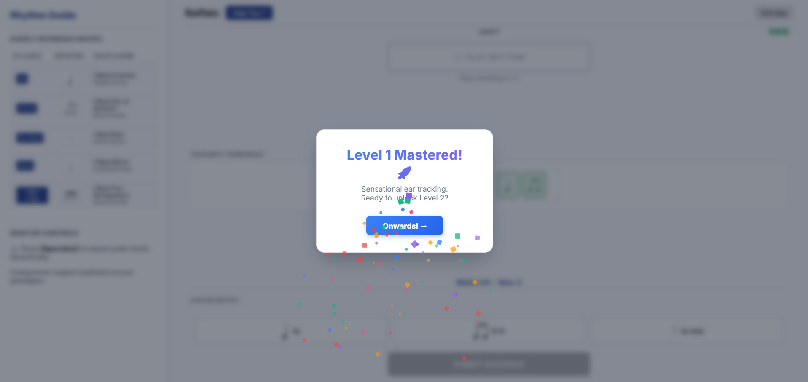
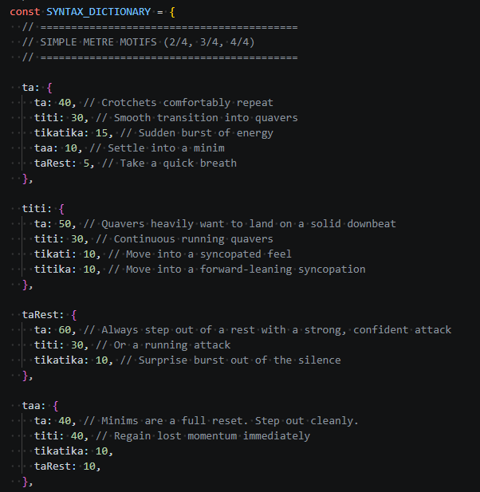
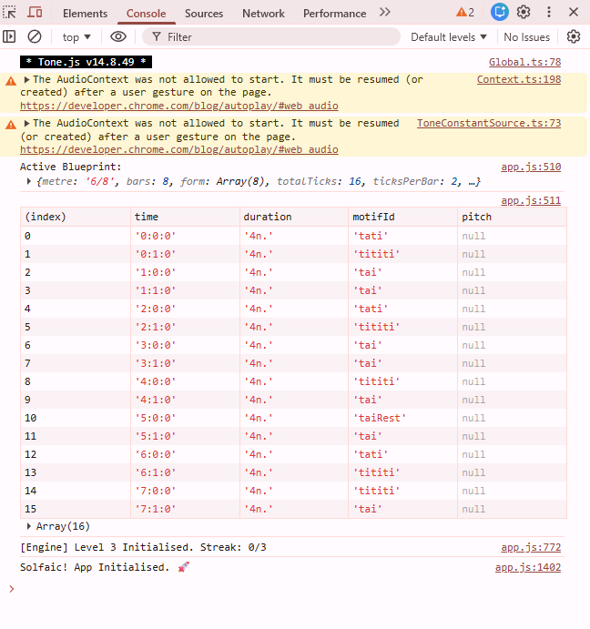
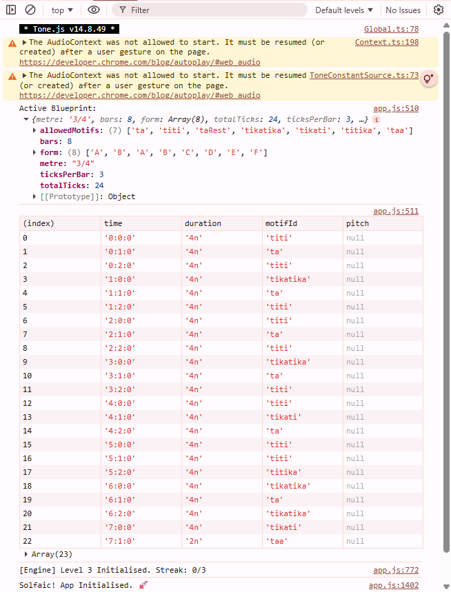
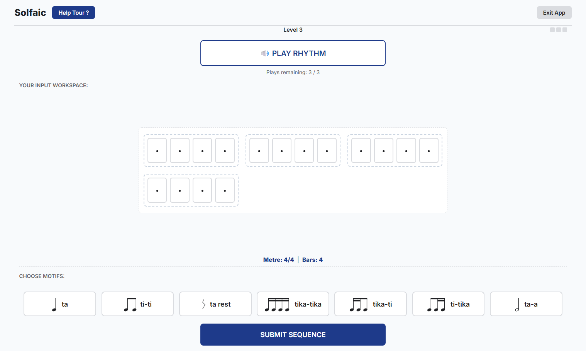
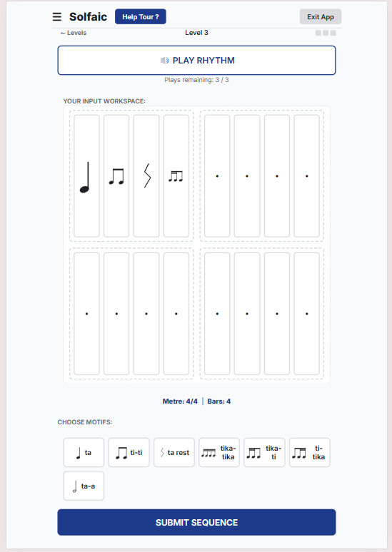
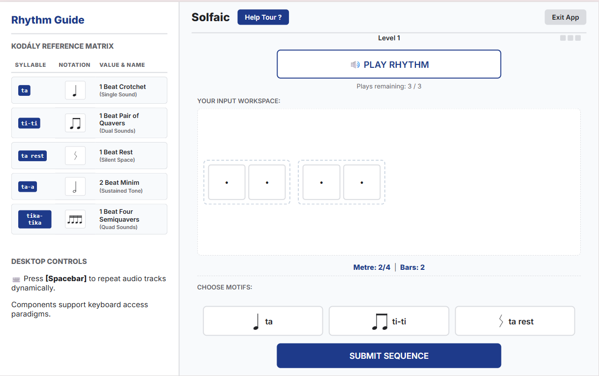
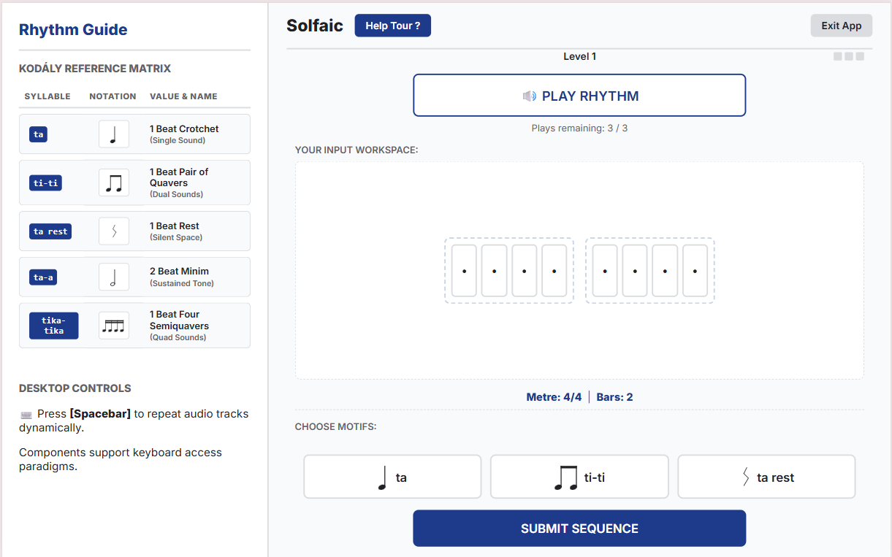

# Solfaic - Solfège Ear Trainer

**[🔴 LIVE APPLICATION: Click here to view the deployed site on GitHub Pages](https://stockol.github.io/solfaic/)**

Solfaic is an interactive web application designed to isolate and build rhythmic dictation and metric internalisation through a pedagogical progressive "ladder". It adheres to a core tenet of music theory education that a foundation in structural rhythm processing must be developed before pitch in the understanding of melody.

The underlying software architecture is intentionally decoupled and extensible, built as a standalone module ready to support a future Solfège pitch-training framework without structural rewrites.

---

## Table of Contents

1. [Project Purpose & User Stories](#1-project-purpose--user-stories)
2. [Strategic Research](#2-strategic-research)
3. [UX Design Strategy (The 5 Planes)](#3-ux-design-strategy-the-5-planes)
4. [System Architecture & Logic Maps](#4-system-architecture--logic-maps)
5. [Core Features & UI Overhauls](#5-core-features--ui-overhauls)
6. [Testing & The Mobile Chronicles (Bug Tracking)](#6-testing--the-mobile-chronicles-bug-tracking)
7. [Deployment Guide](#7-deployment-guide)
8. [Credits & Acknowledgements](#8-credits--acknowledgements)
9. [Development Log & Engineering Phases](#9-development-log--engineering-phases)

---

## 1. Project Purpose & User Stories

### 1. The Examination/Audition Candidate

_Focus: Precision, pressure-testing, and structural success._

- **User Story:** As an aural examination applicant, I want to practise identifying rhythmic motifs within a structured progression so that I can build the metric accuracy required for my upcoming entrance test.
  - _Acceptance Criterion:_ The user is presented with generated exercises that increase in metric complexity (varying time signatures and subdivisions) across distinct levels.
- **User Story:** As a music student, I want to receive immediate diagnostic feedback when I submit an incorrect motif sequence so that I do not "rehearse" the wrong rhythmical patterns into long-term memory.
  - _Acceptance Criterion (BDD):_ **Given** the user has submitted an incorrect motif sequence, **When** the system evaluates the response array against the target timeline, **Then** a diagnostic modal appears explaining the specific durational or structural motif error.
- **User Story:** As a candidate simulating exam conditions, I want a strict limit on audio playbacks so that I am forced to rely on internal memory rather than continuous looping.
  - _Acceptance Criterion:_ Once the audio playback has been triggered three times, the playback option becomes unavailable for that specific exercise.

### 2. The Music Educator (The Facilitator)

_Focus: Pedagogy, motif-based learning, and consistency._

- **User Story:** As a music teacher, I want my students to practise with real pedagogical rhythmic motifs (e.g., dotted rhythms, pairs of quavers) rather than continuous random durations so that training mirrors real-world repertoire.
  - _Acceptance Criterion:_ All generated exercises are algorithmically composed from predefined musical motif object blocks that sum perfectly to the level's designated time signature and bar constraints.
- **User Story:** As a teacher recommending a practice tool, I want the app to function cleanly on small mobile browsers so that students can execute training sessions efficiently on the go.
  - _Acceptance Criterion:_ The layout utilises **Intrinsic Web Design** principles (The Switcher and The Stack) to ensure all interactive elements remain accessible and well-spaced on small viewports without vertical overflow.

---

## 2. Strategic Research

### 1. Teoria (The Desktop Maestro)

- **The High Note (What works):** Excellent **Functional Patterns** for customisation. Allowing users to "register" their own practice session (intervals vs scales) mirrors how a choir director selects a specific warm-up.
- **The Flat Note (What fails):** Poor **Intrinsic Responsiveness**. It lacks the **Axioms of Layout** required for modern web apps — specifically, it doesn't handle the "narrow context" of mobile viewports well, leading to a fragmented user experience.
- **Innovation:** I will use **Every Layout's "The Switcher"** to ensure selection pads gracefully cascade from wide columns on desktop down to massive, thumb-friendly touch blocks on mobile.

### 2. freeCodeCamp Drum Machine (The Audio Interface Scaffolding)

- **The High Note (What works):** Exceptional structural blueprint for mapping client-side interactive buttons to instantaneous audio sampler buffer responses and tracking active UI states cleanly.
- **The Flat Note (What fails):** Entirely reactive architecture; it lacks any system for scheduled timing grids, automated timeline sequence loops, or objective entry validation.
- **Innovation:** Solfaic isolates the interactive audio pad mechanism of a drum machine but steps it up into a Scheduled Timeline Matrix, feeding static loops into deterministic evaluation processors.

---

## 3. UX Design Strategy (The 5 Planes)

### Initial Wireframes

### I. Strategy

- **User Goals:** To master complex metric identification and rhythmic cell dictation through an interactive, step-by-step training workspace.
- **Target Audience:** Practical music candidates, choral applicants, and contemporary musicians seeking to formalise their rhythmic perception.
- **The Future Runway:** The system architecture functions as an isolated structural base; the event timelines are pre-wired to integrate a pitch module seamlessly.

### II. Scope

- **Algorithmic Rhythm Synthesis:** Exercises are compiled dynamically at runtime by reading level parameters (metre, bar count) and randomly assembling predefined motif blocks.
- **Extensible Event Architecture:** To support future pitch expansion, all generation loops output an array of Event Objects featuring explicit `pitch: null` metadata spaces.
- **Diagnostic Evaluation Engine:** Evaluates user-submitted arrays item-by-item against a hidden target timeline to identify errors without maintaining data-heavy tracking profiles.
- **Session-Only Memory Profile:** Progression, scores, and streaks are handled entirely in active session memory, bypassing backend database requirements for the MVP.

### III. Structure

- **Gated Dual-Phase Identification:** The user must successfully reconstruct the rhythmic timeline before the system advances (mirroring professional rehearsal techniques).
- **The Controlled Playback Lifecycle:** To maintain maximum concentration, all workspace pads are disabled while the audio player executes the timeline sequence. Play count tokens permanently lock the engine once the pool hits zero.
- **The Audio Signal Chain:** 1. **The Count-In:** Generates a steady click metronome pattern to lock the student's ear. 2. **The Call:** A decoupled audio wrapper plays back the target sequence using a high-fidelity synth.

### IV. Skeleton

- **The Motif Switcher Console:** The core input panel utilises a dynamic wrapping grid. On desktop, pads layout in a horizontal bar; on mobile, they automatically stack into thumb-friendly touch targets.
- **The Input Workspace Stack:** View elements flow in a strict vertical order derived from a Modular Scale, preventing text crowding.

### V. Surface

- **Aesthetic Principle:** "Timeless, not cutting edge" — prioritising immediate cognitive clarity, minimal distraction, and structural accessibility.
- **Axiomatic Typography:** Instructional text measures are capped at a readable layout width to ensure eye-tracking comfort.
- **Semantic Colour Palette:** AAA-accessible high-contrast schema conveying states immediately: Active Focus (Blue), Validation Success (Green), and Diagnostic Remediation (Amber/Red).

### Pedagogical Whimsy & Interaction Philosophy

Educational software requires engagement. To fight cognitive fatigue, we injected subtle moments of interaction "whimsy":

- **Custom Spring-Loaded Success Overlays:** Deprecated disruptive browser alerts in favor of an elegant, canvas-wide custom HTML5 victory modal utilising custom spring-physics curves.
- **Staggered Cinematic Confetti Downpour:** Initiates a highly dense, 160-particle colourful confetti storm with 3D-depth and randomised start delays up to 1.5 seconds.

- **Tactile Frustration Microgestures (Error Handling):** Attempting to submit an incomplete exercise causes the entire canvas row to execute an aggressive **horizontal frustration shake** (`is-shaking`), while empty slots flash with a **crimson halo pulse** (`is-empty-panic`).
- **Touch-First Sensation Mapping:** Hover definitions are suppressed entirely on mobile to eliminate sticky layout scaling freezes. Touch inputs focus exclusively on the high-fidelity `:active` state, delivering a crisp, immediate touch-down spring compression feel (`scale(0.96)`) the precise millisecond a finger makes contact.

---

## 4. System Architecture & Logic Maps

To guarantee clean maintainability and extensible software updates, Solfiac isolates its core processes across distinct modules: Data Generation, State Control, and a Decoupled Playback Wrapper.

### The Global State Machine (The Game Loop)

The application operates as a deterministic State Machine, strictly controlling permitted actions to preserve examination conditions.

- Defensive Lockout (`playbackState`): Safely prevents the user from registering answers early or breaking the layout flow during audio execution.
- The Modular Gateway (`loadLevelSettings`): Flushes workspace arrays, pulls configuration rules, and triggers generation modules without mutating global files.

### The Multi-Phase Data Pipeline (The Movable-Do Bridge)

Transforms raw configuration files into a timed sequence map.

- **Decoupled Data Contracts:** The sequence matrix revolves around a unified object schema containing `pitch: null` placeholders. Melodic integration later will require absolutely no structural rewrites.

### Asynchronous Timeline Synchronisation (The Sequence Map)

Maps how the browser UI, Central Engine, and Web Audio API share execution data asynchronously without clogging the primary browser thread.

- **Callback-Driven Unlocking:** The workspace stays locked until a clean `onComplete` signal clears the native audio runtime scheduling buffer, protecting timing against system discrepancies.

---

## 5. Core Features & UI Overhauls

### The Desktop Dashboard & Curriculum Matrix Sprint

The application's viewport matrix was refactored to optimise widescreen real estate, introducing a dual-column layout strategy.

**1. Asymmetric Fluid Grid Shell**
On displays wider than `1024px`, the layout fractures into an asymmetrical grid system (`grid-template-columns: 400px 1fr`). Placing the curriculum reference panel on the left ensures the user's eye scans educational rules before executing interactions.

**2. Structured Kodály Reference Matrix Table**
Refactored static bulleted lists into a high-density semantic data table:

| Syllable    | Notation | Value & British Term                  |
| :---------- | :------: | :------------------------------------ |
| `ta`        | `[SVG]`  | 1 Beat Crotchet (Single Sound)        |
| `ti-ti`     | `[SVG]`  | 1 Beat Pair of Quavers (Dual Sounds)  |
| `ta rest`   | `[SVG]`  | 1 Beat Rest (Silent Space)            |
| `ta-a`      | `[SVG]`  | 2 Beat Minim (Sustained Tone)         |
| `tika-tika` | `[SVG]`  | 1 Beat Four Semiquavers (Quad Sounds) |

**3. The 85vw Off-Canvas Mobile Drawer Optimisation**
Expanded the mobile drawer slide-out width from a rigid `280px` up to a fluid **`85vw`** constraint (capped at `420px`). Combined with a localised mobile typography pass, the complex musical tables render with absolute geometric spacing on any iOS or Android glass surface without crunching adjacent columns.

### Persistent Slot-State Memory & Surgical Error Workflow

Wiping a student's entire input ledger after a single incorrect rhythm element introduces an aggressive cognitive penalty.

- **The Solution:** Implemented a persistent state tracking matrix (`slotStates`). Individual cards now retain their targeted validation memory (`success` or `error`) independently. When a student attempts a corrective pass, clicking an error card clears _only that specific beat_, leaving correct blocks perfectly preserved as an interactive roadmap.

### Unified Dual-Input Interaction Engine

- **Desktop Environments:** Full HTML5 native **Drag-and-Drop** implementation allows students to grab selector pads and drop them onto the ledger.
- **Mobile Environments:** A targeted **Touchscreen Focus Ring Modifier**. Tapping an empty placeholder highlights that coordinate with an active blue focus ring, allowing subsequent pad selections to snap instantly into the targeted slot.

### Articulated Audio Synthesis Engine

- **Acoustic Delineation:** Shifted to a warm, resonant triangle wave oscillator (`Synth`) voiced at a crisp, mid-range register (`G3`).
- **The Articulation Gap:** Solved the problem of consecutive identical notes blending into a muddy tone by scaling durations to **82% of their structural metric space**, creating crisp acoustic separation between attacks.

---

## 6. Testing & The Mobile Chronicles (Bug Tracking)

### Manual & Automated Testing

- **[PLACEHOLDER: Document manual testing methodology here]**

- Lighthouse Scores:

### The Mobile Chronicles (Cross-Browser Bug Hunt)

Deploying a highly interactive canvas to modern mobile touchscreens exposed aggressive, device-specific optimisations.

**1. The iOS WebKit SVG Flexbox Collapse**

- **The Pain:** Rhythmic motif cards expanded horizontally, spilling off the right-hand edge of mobile screens.
- **The Diagnostic/Architecture:** iOS Safari ignores aspect calculations for SVGs containing dynamic `width="100%"` configurations in flexible rows. We hardened grid track items with a strict structural reset override (`min-width: 0`) and forced internal vector children to observe strict relative proportions (`height: 100%; width: auto; max-width: 100%;`).

**2. The Native iOS Interactive Tint Override**

- **The Pain:** Buttons discarded style guide variables and rendered in an aggressive native blue hyperlink colour.
- **The Diagnostic/Architecture:** Mobile Safari intercepts `<button>` tags to save data. Injected a deep-level appearance strip command (`-webkit-appearance: none; appearance: none;`) across the interaction deck and hard-locked typography variables with `!important`.

**3. The 'Content-Visibility' Animation Strike**

- **The Pain:** Custom spring animations froze solid.
- **The Diagnostic/Architecture:** The `content-visibility: auto` utility segregated elements into isolated layout contexts, causing the browser to stop tracking dynamic transforms mid-flight. Completely removed visibility containment properties (`contain: none;`) to restore 60FPS execution runways.

**4. The Simultaneous Layer Promotion Trap**

- **The Pain:** The tactile horizontal frustration shake microgesture vanished entirely on clicks.
- **The Diagnostic/Architecture:** Adding `will-change: transform` inside the active animation class caused a GPU layer creation delay (1-frame paint freeze), bypassing the animation lifecycle. Moved the hardware allocation instruction up to the base workspace element style permanently.

**5. Style Batching Optimisation & The Forced Reflow Solution**

- **The Pain:** JavaScript successfully added/removed the `.is-shaking` class, but visual elements remained totally rigid.
- **The Diagnostic/Architecture:** Modern layout threads batch redundant work to save battery. Adding a class and scheduling a `setTimeout` to strip it 500ms later caused the browser to skip painting the intermediate frames entirely. We injected an explicit layout calculation interrupt (**`void bar.offsetWidth;`**) to break the batching mechanism and force an immediate frame refresh.

---

## 7. Deployment Guide

This project was developed using Git version control and is hosted on GitHub. It has been deployed as a live web application using **GitHub Pages**.

### Deployment Steps

To deploy the site to GitHub Pages, the following steps were executed:

1. **Repository Access:** Navigate to the project's repository on GitHub.
2. **Settings:** Click on the **Settings** tab located in the repository's main navigation bar.
3. **Pages Configuration:** In the left-hand sidebar, scroll down to the "Code and automation" section and click on **Pages**.
4. **Source Selection:** Under the "Build and deployment" section, ensure the "Source" dropdown is set to **Deploy from a branch**.
5. **Branch Targeting:** Under the "Branch" section, click the primary dropdown and select the **`main`** branch. Ensure the folder dropdown next to it is set to **`/ (root)`**.
6. **Save & Build:** Click the **Save** button. This triggers a GitHub Actions workflow that builds and deploys the site.
7. **Live Link:** After a few minutes, a notification appears at the top of the Pages settings stating, _"Your site is live at [[URL](https://stockol.github.io/solfaic/)]"_. This link was then added to the top of this README document.

### Local Deployment (Cloning)

To run this project locally on your own machine:

1. Navigate to the GitHub repository.
2. Click the green **`<> Code`** button.
3. Copy the HTTPS URL provided.
4. Open your local terminal/IDE and run: `git clone [https://github.com/StockoL/solfaic.git]`
5. Open the cloned directory and launch `index.html` in your browser (or use an extension like VSCode's Live Server for hot-reloading).

---

## 8. Credits & Acknowledgements

- **Tone.js (v14):** External library used to power the Web Audio API synthesis pipeline.
- **Josh Comeau ("Whimsical Animations" Course):** A massive portion of this release's visual delight is directly inspired by Josh's design philosophy. His teachings on digital weight, spring physics, and intentional micro-interactions provided the groundwork for our tactile card scaling, staggered confetti particle engine, and non-transactional visual payoffs.
- **Every Layout:** Principles of "Intrinsic Web Design" (The Stack, The Switcher) heavily informed the CSS architecture.

### AI Pair Programming & Academic Integrity

In alignment with modern software engineering practices and course academic integrity guidelines, Artificial Intelligence (LLMs) was utilised strictly as a "Pair Programmer" and technical sounding board throughout the development lifecycle, rather than an automated generation tool.

The core pedagogical logic, Kodály curriculum mapping, system architecture, and UX design decisions were entirely human-engineered. AI tooling was leveraged specifically as an accelerator for the following tasks:

- **Cross-Browser Debugging:** Diagnosing obscure, device-specific rendering engines (e.g., identifying the root cause of the iOS WebKit SVG Flexbox collapse and diagnosing the CSS transition race conditions causing tooltips to flicker).
- **Architecture Consultation:** Discussing the mathematical tradeoffs between static media queries versus the modern fluid `clamp()` viewport flex-compression model used in the final build.
- **Code Review & Linting:** Acting as a strict linter to suggest cleaner, more performant ES6 syntax during the refactoring phases (e.g., ensuring DOM elements were safely cached and defensive programming checks were in place).
- **Documentation Structuring:** Assisting in formatting the development logs and technical specs into a professional, open-source standard layout.

Every line of code suggested by AI was critically reviewed, tested, and manually integrated by the developer to ensure absolute comprehension and complete ownership of the final application architecture.

### Technologies Used

- **HTML5:** Semantic structural markup providing an accessible foundation.
- **CSS3:** Custom properties (variables), Flexbox, CSS Grid, and modern dynamic viewport units (`dvh`) to engineer a responsive, intrinsic layout without relying on heavy external frameworks like Bootstrap.
- **JavaScript (ES6+):** Vanilla JavaScript powering the Model-View-Controller (MVC) architecture, custom state machine, event delegation, and DOM rendering pipelines.
- **Tone.js (v14):** A Web Audio API framework utilised for high-fidelity triangle wave synthesis, precise metric timing, and transport sequence scheduling.
- **Inline SVG:** Scalable Vector Graphics embedded directly into the DOM for pixel-perfect, infinitely scalable musical notation that inherits CSS colour states.
- **Git & GitHub:** Utilised for atomic version control, feature branching, and live cloud deployment via GitHub Pages.
- **W3C & JSHint:** Strict code validation tools used during the final polish phase to ensure 100% compliant HTML/CSS and error-free JavaScript execution.

---

## 9. Development Log & Engineering Phases

To ensure a clean, maintainable, and scalable codebase, this application was built using atomic commits following the Model-View-Controller (MVC) design pattern.

### Phase 1: The Intrinsic Skeleton (HTML/CSS)

- `feat(ui): scaffold raw semantic HTML skeleton for rhythm workspace`
- `style: establish design tokens and Every Layout intrinsic primitives`
- `style: apply visual hierarchy and component styling to workspace elements`
- `style(typography): integrate Inter for UI and Noto Music for cross-platform notation rendering`

**Challenge & Resolution:** Initially used a flexbox "Switcher" primitive for motif pads, which forced buttons into a single un-usable vertical column on mobile. Upgraded the layout to a true CSS Grid with the RAM pattern (`repeat(auto-fit, minmax(min(140px, 100%), 1fr))`), guaranteeing neat 2x2 grids on mobile.

### Phase 2: The Data Brain (Model & State)

- `chore(architecture): map JS module stubs and establish musical domain library`
- `feat(core): initialise data models, global state machine, and DOM cache`

**Challenge & Resolution:** Needed an algorithmic way to generate randomised rhythms, but scheduling in milliseconds would break audio if tempo changed. Future-proofed the generator by hard-calculating Tone.js compatible `Bars:Beats:Sixteenths` timestamps (e.g., `0:2:0`). Used JSDoc (`/** @param ... */`) to establish data contracts.

### Phase 3: The View Controller (Wiring the Logic)

- `feat(engine): implement algorithmic rhythm sequence generator`
- `feat(view): implement dynamic DOM rendering cycle for level initialisation`
- `feat(interaction): implement state-aware event handlers for motif selection`

**Challenge & Resolution:** Dropping all controller logic into the file at once risks triggering `undefined` errors. Left the `window.addEventListener("DOMContentLoaded")` block empty until the very last commit to safely build and verify logic in a modular fashion.

### Phase 4: The Evaluation Engine & Pedagogical Refinement

- `feat(data): implement British Kodaly Academy curriculum mapping for MVP levels 1-3`
- `feat(evaluation): implement granular beat-by-beat validation engine and state routing`
- `refactor(ui): migrate from unicode text characters to inline SVG library`

**Challenge & Resolution:** The "Unicode Typography Wall." I initially used the `Noto Music` font to render notes. Because different symbols belong to different Unicode blocks, they had wildly different bounding boxes, breaking alignment. Abandoned text-based font rendering for an inline SVG architecture, mirroring industry standards (Soundtrap/Flat.io) and guaranteeing pixel-perfect alignment.

### Phase 5: The Audio Engine

- `feat(audio): integrate Tone.js scheduling engine for accurate target array playback`
- `fix(audio): implement subdivision parsing array to render accurate dictation rhythms`
- `feat(audio): implement visual and auditory count-in modal synchronised with Tone.Transport`

**Challenge & Resolution:** The "Robotic Crotchet" Bug. Initially, Tone.js played a single woodblock hit for every motif block, failing to distinguish subdivisions of a `ti-ti`. Added a `playback` array to the library (e.g., `["8n", "8n"]`) and wrote a smart parser to flatten the sequence into precisely timed micro-events.

---

### Phase 6: The Onboarding Architecture Evolution (v1.0 to v2.1)

**v2.0: The Accessibility & Fluid Viewport Refactor**

- **The Problem:** The V1 onboarding modal forced an immediate interruption on load (poor accessibility), and the layout relied on Javascript scroll-tracking that failed unpredictably on mobile browsers due to asynchronous rendering (The Post-Scroll Paradox).
- **The Solution:** Moved the tour to a persistent, user-triggered 'Help' button. Completely rebuilt the application shell using a fluid `100dvh` flex-compression model (`min-height: 0`, `clamp()`) to eliminate vertical scrolling. Tooltip coordinates are now mapped statically, resulting in a locked, native-app feel across all screen sizes.

**v2.1: Resolving Animation Race Conditions & FOUC**

- **The Problem:** During onboarding step transitions, the tooltip exhibited a "Top-Left Flying Flicker" and a "Flash of Future Content" (FOUC). CSS transitions on spatial coordinates (`top`/`left`) conflicted with JavaScript's instantaneous DOM text mutations and coordinate recalculations.
- **The Solution:** Decoupled spatial properties from CSS transitions, restricting CSS animations strictly to `opacity` and `transform`. Refactored the JS execution block to leverage delayed DOM injection (`setTimeout`), ensuring text mutations occur _after_ the element drops to `opacity: 0`. Finally, forced a synchronous browser reflow (`void element.offsetWidth`) before fading back in to guarantee flicker-free rendering.

---

## Phase 7: The Phrase Engine Refactor (Algorithmic Pedagogy)

The most significant architectural upgrade to the application was the complete rewrite of the rhythm generation pipeline. The initial prototype utilised a "Bucket Generation" system, which simply selected random motifs until the mathematical duration of the bar was filled. While mathematically sound for `Tone.js` parsing, it produced sterile, unmusical sequences that lacked standard phrasing, leading to an unreasonably high cognitive load for dictation students.

To transition the app from a random generator to a pedagogical teaching tool, the core logic was refactored into a **Structural Phrase Engine**, built upon three distinct pillars:

### 1. The Form Router & Memory Cache (Macro-Structure)

To emulate natural musical syntax, the engine now processes sequences through a Data-Driven Form Router.

- **The Concept:** Instead of generating 4 or 8 arbitrary bars, the engine reads from `FORM_TEMPLATES` containing classical structures (e.g., A-B-A-C Period, AABA Pop Form).
- **The Execution:** As the engine loops through the form array, it checks a temporary `phraseCache` object. If it encounters a new letter ('A'), it generates a discrete mathematical bar and caches it. When it encounters that letter again, it bypasses the generator entirely and clones the array from memory.
- **Pedagogical Value:** This provides the student with "Antecedent and Consequent" phrasing. Hearing a bar repeat gives the student a dopamine hit of recognition, significantly lowering the cognitive load and allowing them to focus deeply on the contrasting 'B' and 'C' sections.

### 2. The Markov Syntax Dictionary (Micro-Structure)

To fix the "unmusical" nature of the internal bars, flat `Math.random()` selection was replaced with a **Weighted Lottery Algorithm** governed by a Markov Syntax matrix.

- **The Concept:** In spoken language, grammar dictates that certain words follow others. In Kodály methodology, rhythms operate on "Tension and Release" (e.g., four rapid semiquavers deeply want to resolve to a stable crotchet).
- **The Execution:** The `SYNTAX_DICTIONARY` maps every motif to a set of probabilities for the subsequent beat. When placing a block, the engine checks the `previousMotif`, looks up the grammar rules, and runs a weighted draw.
- **Pedagogical Value:** A `titika` now has a 70% chance of landing safely on a `ta` (release). This guarantees the engine generates highly idiomatic, natural-sounding patterns that the human ear can easily chunk together, rather than random noise.

### 3. The Cadence Interceptor (Musical Resolution)

The final challenge was ensuring that generated phrases musically resolve, without accidentally generating mathematically impossible bars that would crash the Tone.js transport.

- **The Concept:** A 4-bar phrase should act as a complete musical thought, ending in a Perfect or Imperfect Cadence (rhythmically, typically a Crotchet or Minim), rather than a frantic subdivision.
- **The Execution:** When the Form Router detects the absolute final bar of a sequence, it passes a `forceCadence` flag into the bar generator. The generator utilises a mathematical intersection filter: it cross-references the remaining space in the bar with a curated `CADENCE_MOTIFS` array. If a stable motif perfectly fits the remaining mathematical ticks, it hijacks the weighted lottery and forces the resolution.

### Data Architecture (DRY Principles)

To support this logic without bloating the codebase, the configuration arrays (`MOTIF_POOLS` and `FORM_TEMPLATES`) were completely abstracted from the main `levelRules` progression matrix. The engine dynamically stitches these rules together utilising ES6 Spread Syntax (`...`), ensuring the app remains highly scalable and DRY as new levels are introduced.

### Quality Assurance & Bounds Testing

Extensive developer testing was required to ensure the Cadence Interceptor and Form Router did not create mathematical memory leaks. The Tone.js framework is strictly typed regarding time, so any compound motifs leaking into a simple metre grid would cause an immediate crash.

> **Fig 1:** Console output confirming the intersection filter successfully protected a 6/8 compound grid, producing mathematically perfect 2-beat sequences.

> **Fig 2:** Console output of an 8-bar Sentence Form generation. Note the successful memory cache execution (Indexes 6-8 perfectly mirroring Indexes 0-2) and the successful Cadence Interceptor triggering at the final sequence beat (Index 22).

---

## Phase 8: The Responsive "Sponge" Architecture (UI/UX)

Translating rigid musical syntax (2, 4, and 8-bar phrases) into a fluid web interface presented a significant layout challenge. Standard responsive techniques often resulted in "syntactical breaking" (e.g., a 4-bar phrase wrapping awkwardly into 3 bars on the top row and 1 bar on the bottom) or "vertical blowouts" where tall screens stretched musical notation cards into distorted, unreadable rectangles.

To guarantee a pristine user experience on every device — from an iPhone SE to a 4K Desktop monitor—the workspace was rebuilt using a highly constrained, custom CSS architecture:

- **The Viewport Sponge Constraint:** To prevent the user from ever having to scroll to find the "Submit" button, the primary workspace was given `flex: 1 1 0` with a strict `min-height: 0`. This allows the workspace to act as a "sponge," dynamically measuring the exact space between the top controls and bottom controls, and squishing the musical grid to fit perfectly within the viewport.
- **Proportional Grid Clamping:** To prevent cards from elongating into skyscrapers on tall devices (like iPads), dangerous `aspect-ratio` rules were removed. Instead, the CSS Grid utilises `grid-auto-rows: clamp(55px, 10vh, 100px)`. This enforces a strict physical ceiling: the cards will grow to a mathematically proportional size and then stop, floating elegantly in the vertical center of the available space.
- **Syntactical Auto-Grids & Quantity Queries:** The grid strictly enforces musical phrasing. On mobile, it utilises a 2-column layout (perfectly stacking 2, 4, and 8-bar phrases). On desktop, it enforces a 4-column sheet-music layout. To solve the issue of a 2-bar Level 1 phrase sitting awkwardly on the left edge of a 4-column desktop grid, an advanced CSS **Quantity Query** (`.workspace-bar:first-child:nth-last-child(2)`) was deployed. This algorithmically detects if exactly two bars exist in the DOM and automatically pushes the first bar into the second column, resulting in mathematically perfect centering.

---
