# Solfaic - Solfège Ear Trainer

[](https://github.com/StockoL/solfaic/blob/main/LICENSE)
[](https://github.com/StockoL/solfaic)
[](https://github.com/StockoL/solfaic)
[](https://github.com/StockoL/solfaic)
[](https://github.com/StockoL/solfaic)
[](https://github.com/StockoL/solfaic)

**<a href="https://stockol.github.io/solfaic/" target="_blank" rel="noopener noreferrer">🔴 LIVE APPLICATION: Click here to view the deployed site on GitHub Pages</a>**

Solfaic is an interactive web application designed to isolate and build rhythmic dictation and metric internalisation through a pedagogical progressive "ladder". It adheres to a core tenet of music theory education that a foundation in structural rhythm processing must be developed before pitch in the understanding of melody.

The underlying software architecture is intentionally decoupled and extensible, built as a standalone module ready to support a future Solfège pitch-training framework without structural rewrites.

---

## <a name="top"></a>📋 Table of Contents

1. [📖 Project Purpose & User Stories](#purpose)
2. [🔬 Strategic Research](#research)
3. [🖼️ UX Design Strategy (The 5 Planes)](#ux-strategy)
4. [🗺️ System Architecture & Logic Maps](#architecture)
5. [✨ Core Features & UI Overhauls](#features)
6. [🌐 Deployment Guide](#deployment)
7. [🤝 Credits & Acknowledgements](#credits)
8. [🏗️ Development Log & Engineering Phases](#dev-log)
9. [🧪 Testing & Quality Assurance Portfolio](#testing)
10. [📜 Legacy: Version 1](#legacy)

---

## 1. <a name="purpose"></a> 📖 Project Purpose & User Stories

### 1. The Examination/Audition Candidate

_Focus: Precision, pressure-testing, and structural success._

- **User Story:** As an aural examination applicant, I want to practise identifying rhythmic motifs and melodic solfège patterns within a structured progression so that I can build the metric accuracy required for my upcoming entrance test.
  - _Acceptance Criterion:_ The user is presented with generated exercises combining rhythm and pitch (movable-do), increasing in complexity across Levels 1–4, with the underlying curriculum data modelled through Level 9 for future implementation.

- **User Story:** As a music student, I want to receive immediate, specific diagnostic feedback when I submit an incorrect answer, so that I don't rehearse the wrong pattern into long-term memory.
  - _Acceptance Criterion (BDD):_ **Given** the user has submitted an incorrect rhythm or pitch sequence, **When** he system evaluates the response against the target, **Then** only the incorrect elements shake (not the whole board), and a diagnostic modal names the specific mistake — the rhythm to practise, or, for pitch errors, the actual interval that needs work, shown as the two notes involved.

- **User Story:** As a candidate simulating exam conditions, I want a strict, fresh limit on audio playbacks for each phase of an exercise, so that I rely on internal memory rather than continuous looping.
  - _Acceptance Criterion:_ Each exercise is dictated in two passes — rhythm, then solfège over the same confirmed rhythm — and each phase carries its own independent 3-play budget, not a shared one.

### 2. The Music Educator (The Facilitator)

_Focus: Pedagogy, motif-based learning, and consistency._

- **User Story:** As a music teacher, I want my students to practise with real pedagogical motifs — both rhythmic and melodic — rather than arbitrary generated content, so that training mirrors real repertoire and follows an authentic Kodály sequence.
  - _Acceptance Criterion:_ Rhythm and pitch content are drawn from curated motif/toneset libraries and combined using weighted Markov transition logic modelled on real melodic and rhythmic tendencies, not uniform randomness.

- **User Story:** As a teacher recommending a practice tool, I want the app to function cleanly across device sizes, so that students can train efficiently anywhere.
  - _Acceptance Criterion:_ The layout follows the CUBE CSS methodology (Composition, Utility, Block, Exception) — intrinsic layout primitives (Cluster, Switcher, Grid, Reel, Spread, and others) govern responsive behaviour without device-specific breakpoint hacks.

### 3. The Kodály Practitioner (Movable-Do Focus)

_Focus: developing genuine relative pitch through movable-do practice, independent of any single fixed key._

- **User Story:** As a self-directed learner without a teacher present, I want the app to teach me the Kodály solfège syllables and their relationships before testing me, so that I can build foundational knowledge independently.
  - _Acceptance Criterion:_ The Classroom page provides per-level guides, real generated notation (Presentation), and hands-on drills (Practice) covering tonesets, intervals, and rhythm content, browsable independently of the Practice Room's testing environment.

- **User Story:** As a student developing relative pitch, I want each exercise generated in a randomly-chosen key, so that I learn to recognise pitch relationships rather than memorising fixed absolute pitches.
  - _Acceptance Criterion:_ No two consecutive exercises are guaranteed to share the same key — each resolves independently to one of a curated set of comfortable, singable starting pitches.

- **User Story:** As a learner distinguishing similar-sounding intervals, I want visual reinforcement of pitch relationships, so that colour becomes a secondary memory aid alongside my ear.
  - _Acceptance Criterion:_ Each solfège syllable is represented by its own distinct, consistent colour throughout the app, following the traditional convention of colour-coded solfège teaching.

### 4. The Accessibility-Conscious User

_Focus: legibility, keyboard operability, and assistive-technology compatibility as first-class requirements, not an afterthought._

- **User Story:** As a user relying on sufficient colour contrast, I want every text-bearing coloured surface — buttons, badges, links, solfège cards — to remain legible regardless of my vision.
  - _Acceptance Criterion:_ Every interactive colour meets WCAG AA's 4.5:1 minimum contrast standard against its paired text. Purely decorative elements, such as the homepage's background animation, are exempt by design, since no text is ever placed on top of them.

- **User Story:** As a keyboard-only user, I want every interactive element — modals, dropdowns, the level selector, the workspace — fully operable without a mouse.
  - _Acceptance Criterion:_ Every modal is fully dismissible and focus-trapped without a mouse, and every interactive element carries a consistent, visible focus state throughout the app.

- **User Story:** As a screen-reader user, I want page structure conveyed through real semantics, not purely visual cues, so that assistive technology can navigate the app accurately.
  - _Acceptance Criterion:_ Semantic HTML and ARIA labelling are used consistently across all interactive components.

<p align="right">(<a href="#top">Back to top</a>)</p>

## 2. <a name="research"></a>🔬 Strategic Research

### 1. Teoria (The Desktop Maestro)

- **The High Note (What works):** Excellent **Functional Patterns** for customisation. Allowing users to "register" their own practice session (intervals vs scales) mirrors how a choir director selects a specific warm-up.
- **The Flat Note (What fails):** Poor **Intrinsic Responsiveness**. It lacks the **Axioms of Layout** required for modern web apps — specifically, it doesn't handle the "narrow context" of mobile viewports well, leading to a fragmented user experience.
- **Innovation:** The Switcher pattern this inspired is now one of ten intrinsic layout primitives in Solfaic's full CUBE Compositions library, rather than a single borrowed technique — selection pads still cascade from wide desktop columns to thumb-friendly mobile blocks with zero device-specific breakpoints.

### 2. freeCodeCamp Drum Machine (The Audio Interface Scaffolding)

- **The High Note (What works):** Exceptional structural blueprint for mapping client-side interactive buttons to instantaneous audio sampler buffer responses and tracking active UI states cleanly.
- **The Flat Note (What fails):** Entirely reactive architecture; it lacks any system for scheduled timing grids, automated timeline sequence loops, or objective entry validation.
- **Innovation:** Solfaic isolates the interactive audio pad mechanism of a drum machine but steps it up into a Scheduled Timeline Matrix — now extended beyond rhythm alone to resolve real pitches via movable-do, feeding a dual rhythm-and-pitch timeline into deterministic evaluation processors.

### 3. LooseLeaf-ui (Prior Personal Design System)

- **The High Note (What works):** A pre-existing, dependency-free CUBE CSS starter system, already built with a working JSON-to-CSS token pipeline and a reusable library of layout compositions and visual blocks.
- **The Flat Note (What fails):** Generic component naming and default token semantics didn't transfer directly — surface-base, for instance, meant "a component's own background" in the source system but needed to mean "the page background" in Solfaic's specific token structure, and several default values (a placeholder blue/purple palette) needed replacing with Solfaic's actual brand.
- **Innovation:** Adapted rather than adopted wholesale — the same architecture and pipeline, with every token and component selector reconciled against Solfaic's specific palette, semantics, and DOM structure before use.

### 4. Andy Bell's CUBE CSS Methodology

- **The High Note (What works):** Resolves the "utility-first vs. semantic CSS" debate by cleanly separating macro-layout (Composition) from visual identity (Block), keeping cascade specificity flat via native CSS layers rather than specificity wars.
- **The Flat Note (What fails):** Doesn't prescribe what to do when no existing layout primitive genuinely fits a project-specific need.
- **Innovation:** Where a real gap existed — a header needing space-between behaviour no existing primitive provided, a workspace grid needing fixed-size rather than stretching columns — a new primitive or dedicated component was added rather than forcing an ill-fitting one to stretch to cover it.

### 5. Phoenix Collective / British Kodály Academy Musicianship Syllabus (Cyrilla Rowsell)

- **The High Note (What works):** A real, professionally-authored progression across 10 levels, giving the melodic engine genuine pedagogical grounding instead of an invented difficulty curve.
- **The Flat Note (What fails):** Written for live teaching — staff notation, ensemble singing, improvisation, work with a piano partner — most of which has no equivalent in an automated, solo dictation engine.
- **Innovation:** Only the generative content — tonesets, cadence targets, rhythm vocabulary, metres — was extracted from the syllabus and modelled as structured data (weighted tonesets and Markov transition tables), deliberately excluding everything that isn't reducible to "generate it, then have the student identify it."

<p align="right">(<a href="#top">Back to top</a>)</p>

## 3. <a name="ux-strategy"></a> 🖼️ UX Design Strategy (The 5 Planes)

### Initial V2 Planning Document

Before the five planes below were worked out in detail, a short planning document ([`docs/v2-initial-planning.pdf`](./docs/v2-initial-planning.pdf)) sketched V2's revised sitemap, workspace card geometry, and starting design-system decisions. Much of what follows in this section is the elaboration of that document rather than a from-scratch redesign — most of its concrete calls (the palette, the type/space scale, the CUBE reorganisation) survived into the shipped app essentially unchanged.

<details>
<summary><b>🔍 Expand Initial V2 Planning Notes & Wireframes</b></summary>

**Revised sitemap** — three pages, replacing V1's single view:

- **Home:** a traditional nav (hamburger on mobile) for Home/Classroom/Practice Room, a hero with a "Practice Now"/"Start" CTA, a footer, and a logo animation "drawn on" navigating the 8 colours used for the solfège buttons — the earliest record of both the colour-coded solfège idea and an animated brand moment, each committed to writing well before either was actually built.

  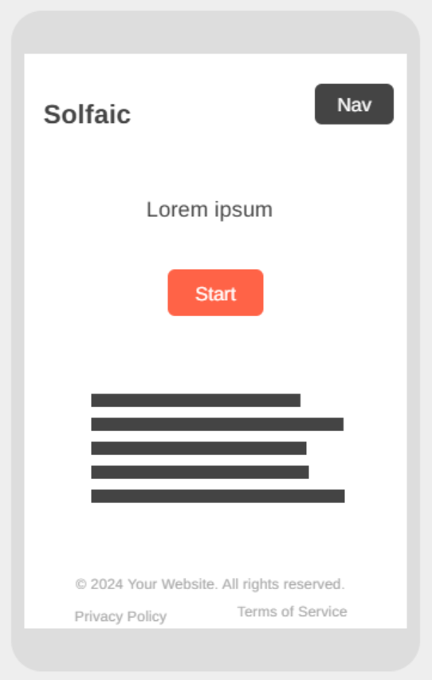

- **Classroom:** a new home for the existing Kodály reference matrix, plus "introductory learning content for each level (togglable) including video explanations." The Classroom page shipped in V2 as planned; so did the reference matrix at first, though it's since been deleted — Presentation now covers the same ground with real generated notation, so the static table was fully redundant. Video explanations never shipped and remain deferred pending real recorded material, not because the idea came later. Presentation, Rhythm/Melodic Workshop, Example, and Interval Detective — now organised under Preparation/Presentation/Practice tabs — are this same "introductory learning content" intention, fulfilled through generated audio and notation rather than video.

  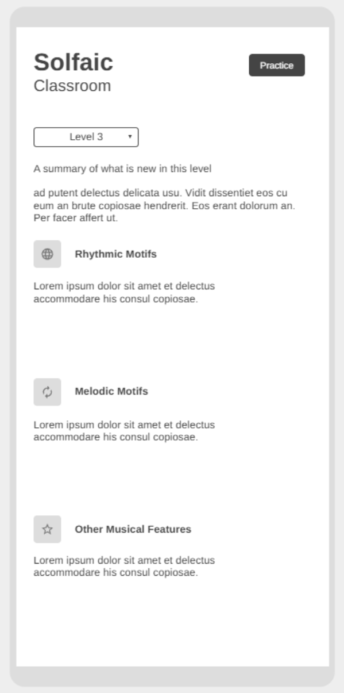

- **Practice Room:** a stripped-back "focus mode" — workspace grid, back/replay/submit buttons, a very thin header, and a new horizontally-scrolling **reel** for browsing input cards, explicitly specified to animate cards on and off "like a rolodex."

  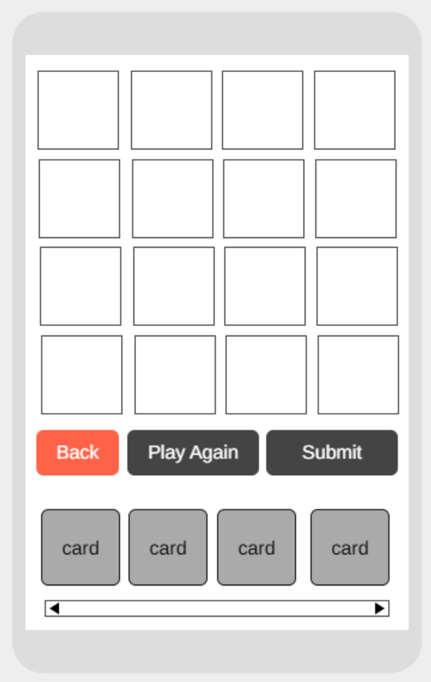

**Workspace card geometry** — the plan hand-enumerated column layouts case by case (`ta`: one centred column; `ta-ti`: three unequal columns, the first two merged; `ti-tika`: four unequal columns, first two merged, then two smaller ones; and so on), with the constraint that a rhythm card's stick positions must vertically align with its solfège card's letters beneath it.

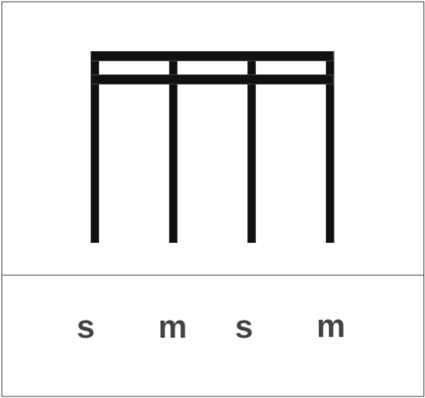

That case-by-case enumeration is exactly what `rhythm-notation.js` later replaced with a single weight-proportional formula, deriving any motif's column layout from one shared duration-weight table instead of hand-tuning each case individually — see [One Source of Truth for Notation](#features).

**Card behaviours (UX)** — several interaction rules were specified up front, including that "users can select from the reel during playback." That rule did carry through: only the Replay and Submit buttons themselves lock against re-entry while audio is sounding (`sessionState.currentState === "PLAYING"`); reel and workspace selection are deliberately left unguarded, exactly as planned.

**Colour palette** — three candidate directions were considered ([option 1](https://coolors.co/202020-63768d-e01a4f-f15946-f9c22e), [option 2](https://coolors.co/4c5454-ff715b-ffffff-1ea896-523f38), [option 3](https://coolors.co/202020-f9c22e-1be7ff-6eeb83-ff5714)) before settling on a bespoke palette, worked out in the same document:

| Token                | Name             | Hex       | Purpose                                    |
| :------------------- | :--------------- | :-------- | :----------------------------------------- |
| Surface (background) | Alabaster Grey   | `#DDDDDD` | Soft, warm off-white to reduce glare       |
| Surface (card/UI)    | White            | `#FFFFFF` | Crisp "sheet music" container effect       |
| Primary (Brand)      | Atomic Tangerine | `#FF6B35` | Hero colour for primary actions/buttons    |
| Secondary (Accent)   | Golden Pollen    | `#FFC857` | Active states, highlights, secondary tools |
| Success              | Muted Teal       | `#82B895` | Legible success state on light backgrounds |
| Text (Primary)       | Graphite         | `#2D2D2D` | High legibility, softer than harsh black   |
| Text (Muted)         | Charcoal         | `#545454` | Secondary text, labels, helper info        |

This table's names and hex values are the exact `atomic-tangerine`/`golden-pollen`/`muted-teal`/`graphite`/`charcoal`/`alabaster-grey` primitives in the shipped `design-tokens.json` — the palette shipped essentially as planned. What the plan didn't yet anticipate: the later accessibility audit (Development Log, phase 3) found several of these values too light for text at AA contrast, and added separately-derived "deep" variants for anything text-bearing, keeping these original values as decoration-only `accent-vivid-*` tokens rather than replacing them outright.

**Typography** — five display/body pairing ideas were sketched against the brand wordmark, one of them "Solfaic and Poppins." The paired display face changed (Galindo, not this document's own hand-lettered "Solfaic," was the eventual heading typeface), but Poppins carried straight through as the shipped body copy face. The fluid type and space scales specified alongside — generated via [utopia.fyi](https://utopia.fyi) at a 1.2 ratio between 320px and 1240px — were carried into `design-tokens.json` unchanged, custom `space-s-l` pair included.

**File directory & CUBE CSS** — the plan opens by citing V1's own file sizes as the reason for the rewrite: 1,630 lines of CSS and 1,619 lines of JavaScript, both in single monolithic files. Adopting Andy Bell's CUBE CSS methodology and splitting into a proper `src/` tree (see [System Architecture & Logic Maps](#architecture) and the repository layout in [Credits & Acknowledgements](#credits)) was the proposed fix — and is what actually shipped.

**Background animation credit** — the hero particle-field concept (see "An Ambient, Branded Hero Animation" below) was sourced in this same document, crediting Louis Hoebregts' CodePen sketch as the starting reference (full credit in [Credits & Acknowledgements](#credits)).

</details>

### I. Strategy

- **User Goals:** To master both rhythmic and melodic (movable-do) dictation through an interactive, step-by-step training workspace, spanning a full pedagogical curriculum grounded in a real Kodály syllabus rather than an invented difficulty curve.
- **Target Audience:** Practical music candidates, choral applicants, and contemporary musicians formalising their aural perception — unchanged from V1's original framing, which held up.
- **The Future Runway:** V1 pre-wired a `pitch: null` field into its data model speculatively, betting the architecture could absorb a future melodic layer without a rewrite. That bet paid off — V2's melodic engine was built directly onto the existing rhythm engine's Markov-chain architecture rather than requiring a parallel system. The new forward-looking bet: Levels 1–4's full pentatonic/diatonic content is live and tested; Levels 5–9's curriculum data (modes, chromatic alteration, modulation) is already modelled, with the generation algorithms for that content deliberately deferred as a distinct future phase rather than attempted prematurely alongside everything else.

### II. Scope

- **Dual-Engine Algorithmic Synthesis:** Rhythm and pitch are generated independently, each from its own curriculum-grounded, weighted Markov transition system, then combined into one coherent sung-and-tapped exercise.
- **Movable-Do Resolution Layer:** Generation itself stays key-agnostic — exercises are produced as relative solfège tokens, with a randomly-chosen tonic resolving them to real, audible pitches only at playback time, training relative rather than absolute pitch recognition.
- **Escalating Diagnostic Evaluation:** Feedback isn't binary correct/incorrect — a graduated sequence runs from a targeted shake on just the wrong elements, to a "listen and try again" prompt with the streak left intact, to phase-specific remediation that names exactly what needs practice.
- **Session-Only Memory Profile:** Progression, scores, and streaks remain entirely client-side, with no backend or database dependency — unchanged from V1.

### III. Structure

- **Multi-Page Information Architecture:** V1's single-page application is now three purpose-built pages — Home (orientation), Classroom (learning the curriculum before testing), and Practice Room (the dictation engine itself) — replacing a single overloaded view with a deliberate learn-then-test flow. Classroom's level selector filters _which curriculum content is being browsed_ (the level guide, the Preparation/Presentation/Practice panels); it has no connection to the active practice session — Practice Room's level is never manually selected.
- **Two-Phase Exercise Resolution:** Each exercise is dictated once and answered twice — rhythm first, then solfège layered over the same confirmed rhythm — rather than treated as two separate listening events.
- **The Audio Signal Chain, extended:** V1's count-in-then-playback sequence now includes a movable-do resolution step between generation and sound, plus a dedicated starting-note cue at the rhythm-to-pitch transition, giving the student a stable reference pitch before the second phase begins.

### IV. Skeleton

- **CUBE Compositions as the Layout Vocabulary:** V1's informal borrowing from Every Layout is now a full, named Composition library — Cluster, Spread, Switcher, Grid, Reel, Container, Wrapper, Center, Sidebar, and Flow — each with a specific, non-overlapping structural job, composed together on the same elements rather than reached for ad hoc.
- **The Practice Room Workspace:** A metre-aware grid (column count follows the exercise's actual time signature rather than a fixed layout), paginated for longer phrases, where each box holds a rhythm card paired with its own solfège entry card beneath it.
- **Navigation Skeleton:** Consistent nav and footer chrome across Home and Classroom; the Practice Room deliberately strips this away entirely in favour of a thin, focus-mode header, protecting concentration during an actual exercise.

### V. Surface

- **New Typeface Pairing:** Galindo for display and heading type, Poppins for body copy — a deliberate rebrand from V1's unspecified system font stack.
- **A Two-Tier, Verified-Accessible Colour System:** Where V1 asserted an "AAA-accessible high-contrast schema," V2's palette is built on an explicit two-tier structure — bright, decorative-only tokens for illustration, and separately-derived, WCAG-verified "deep" variants for anything carrying text — with every text-bearing colour's contrast ratio computed and documented, not chosen by eye.
- **Colour-Coded Solfège:** Each syllable is rendered in its own distinct, consistent colour, following the traditional convention of colour-coded solfège teaching — and, deliberately, several of those colours are the same tokens already used for the app's primary buttons and badges, so the palette reinforces brand identity rather than introducing a disconnected second system.

### Pedagogical Whimsy & Interaction Philosophy

V1's specific examples (confetti, frustration-shake) mostly carried forward conceptually but are joined by new V2-specific whimsy:

- **Colour-Coded Solfège Circles** turn an abstract pitch relationship into an immediate visual one.


- **A Tactile, Physical Primary CTA** - a Comeau-style 3D "pushable" button, reserved deliberately for once-per-page hero moments rather than applied everywhere, so the effect stays a moment of delight rather than becoming visual noise on frequently-clicked buttons like Submit.


- **An Ambient, Branded Hero Animation** — a particle field on the homepage, coloured from the same solfège palette used in the Practice Room, seeding the app's visual language before a student ever reaches an exercise.


- **Cinematic Confetti**, carried over from V1, now correctly layered so the celebration modal reads as sitting in front of the burst rather than beneath it.

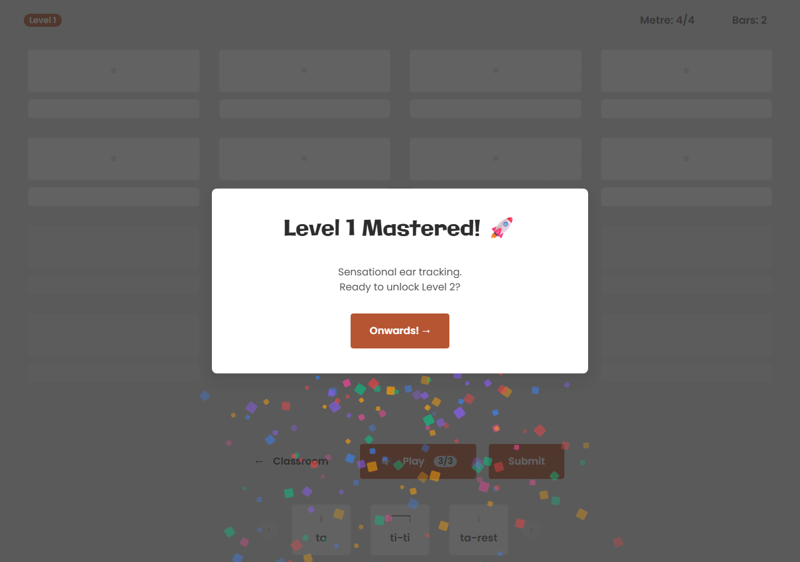

- **Tactile Frustration Microgestures (Error Handling):** Attempting to submit an incomplete exercise causes the entire canvas row to execute an aggressive **horizontal frustration shake** (`is-shaking`), while empty slots flash with a **crimson halo pulse** (`is-empty-panic`).

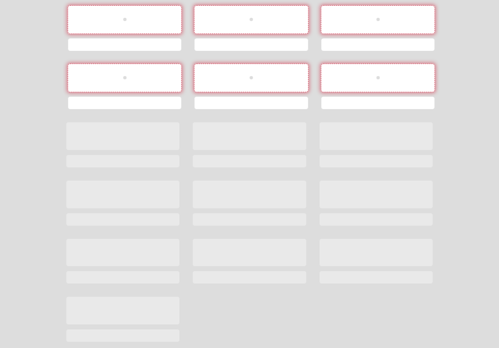

- **Touch-First Sensation Mapping:** Hover definitions are suppressed entirely on mobile to eliminate sticky layout scaling freezes. Touch inputs focus exclusively on the high-fidelity `:active` state, delivering a crisp, immediate touch-down spring compression feel (`scale(0.96)`) the precise millisecond a finger makes contact.


<p align="right">(<a href="#top">Back to top</a>)</p>

## 4. <a name="architecture"></a> 🗺️ System Architecture & Logic Maps

Solfaic V2 separates cleanly into two architectural halves: a **JavaScript engine layer** (rhythm generation, extended to melodic generation) and a **CUBE CSS presentation layer**, neither of which existed in this form in V1.

### The Dual-Engine State Machine

V1's single rhythm-only engine is now two parallel generative systems sharing one architecture:

- **The Rhythm Engine** generates a bar-by-bar timeline via weighted Markov transitions over a curated motif library, exactly as in V1, now extended with anacrusis (pickup-beat) support and irregular-metre grouping.
- **The Melodic Engine**, built directly onto the same architectural pattern rather than as a separate system, generates a parallel solfège line — its own curriculum-grounded, independently-namespaced Markov tables per level and tonal mode, with cadence-forcing genuinely disabled (not just weighted low) wherever a toneset is too sparse to have a real "correct" ending.

Both engines are deliberately key-agnostic at generation time — output is relative solfège tokens and rhythmic values, never absolute pitches, keeping the movable-do principle architectural rather than incidental.

### The CUBE CSS Architecture (New in V2)

Where V1 shipped a single `style.css`, V2's presentation layer is structured in four native CSS cascade layers, later layers always winning regardless of selector specificity:

```text
Reset  →  Global  →  Compositions  →  Blocks  →  Utilities
```

- **Global:** a JSON-driven design token pipeline (`design-tokens.json` → a Node compiler → generated `variables.css`) — colour, type, space, and motion values defined once and consumed everywhere, never hardcoded in component files.
- **Compositions:** ten intrinsic layout primitives (Cluster, Spread, Switcher, Grid, Reel, Container, Wrapper, Center, Sidebar, Flow) governing structure only — no colour, border, or typography ever lives here.
- **Blocks:** self-contained visual components (Button, Nav, Accordion, Modal, Badge, Level-Select), each composing freely with Compositions on the same element rather than duplicating layout logic.
- **Utilities:** single-purpose overrides (visually-hidden, text alignment, ambient animation helpers) sitting at the top of the cascade for deliberate, isolated exceptions.

### The Generative Pipeline (extended from V1's Movable-Do Bridge)

V1 speculatively pre-wired a `pitch: null` field into every timeline event without a resolution mechanism behind it. V2 completes that bridge:

1. **Generation** produces a rhythm timeline and a parallel pitch line independently, each honouring its own level-gated toneset/motif constraints.
2. **Resolution** happens only at playback — a randomly-chosen tonic (from a curated, comfortably-singable set) combines with each solfège token via a semitone-offset lookup table to produce real Tone.js note names, meaning the exact same generated exercise sounds in a different key nearly every time it's played.
3. **Rendering** derives every rhythm card's stick-notation SVG _and_ its paired solfège card's entry-column layout from the same source data (a motif's note-by-note duration weights) — guaranteeing the two cards' columns always align, for any motif, without hand-tuning two separate assets in sync.

### Asynchronous Timeline Synchronisation & Two-Phase Evaluation

Each exercise is dictated once and answered in two passes against the same audio — rhythm, then solfège layered over the confirmed rhythm — with independent play budgets and independent evaluation per phase. Evaluation itself is graduated rather than binary: a first incorrect submission shakes only the wrong elements and prompts a retry without affecting the streak; a second still-wrong submission on the same answer triggers phase-specific remediation — the correct rhythm shown directly, or for pitch, the actual interval (both notes, not just the wrong one) that needs practice.

```text
[ Curriculum Data ]                     [ Design Tokens (JSON) ]
        │                                        │
        ▼                                        ▼
┌────────────────────┐                  ┌─────────────────────────┐
│   RHYTHM ENGINE      │                 │    Token Compiler          │
│   (Markov, motifs,    │                │    → variables.css          │
│   anacrusis, metre)   │                └────────────┬────────────────┘
└──────────┬───────────┘                               │
           │                                           ▼
           ▼                                  ┌─────────────────────────┐
┌────────────────────┐                        │   CUBE Cascade Layers     │
│   MELODIC ENGINE      │                      │   Reset→Global→Comp→     │
│   (Markov, tonesets,   │                     │   Block→Utility            │
│   cadence logic)       │                     └────────────┬────────────────┘
└──────────┬───────────┘                                    │
           ▼                                                │
┌─────────────────────────────┐                             │
│   Movable-Do Resolution        │                           │
│   (tonic + semitone lookup)    │                           │
└──────────┬────────────────────┘                            │
           ▼                                                 │
┌─────────────────────────────┐                              │
│   Audio Engine (Tone.js)       │                            │
│   count-in → playback →         │                           │
│   beat-pulse events               │                         │
└──────────┬────────────────────┘                             │
           │                                                  │
           ▼                                                  ▼
┌───────────────────────────────────────────────────────────────────┐
│         Workspace Render (rhythm-notation.js + CUBE Blocks)          │
│    one weight table → SVG stick notation + solfège grid,             │
│    every element styled entirely through the Block layer above       │
└──────────────────────────────┬──────────────────────────────────────┘
                                ▼
                  ┌──────────────────────────────┐
                  │      User Interaction Loop      │
                  │   (reel selection → workspace     │
                  │   submission, rhythm then pitch)   │
                  └───────────────┬───────────────────┘
                                  ▼
                  ┌──────────────────────────────┐
                  │     Two-Phase Evaluation         │
                  │   graduated feedback per attempt   │
                  └───────────────┬───────────────────┘
                                  │
                ┌─────────────────┴──────────────────┐
                ▼                                      ▼
     [ Correct → next phase,               [ Wrong → targeted shake,
       or streak++ on full                    retry, then phase-specific
       completion ]                            remediation modal ]
```

<p align="right">(<a href="#top">Back to top</a>)</p>

## 5. <a name="features"></a> ✨ Core Features & UI Overhauls

### The Melodic Engine & Two-Phase Dictation

The headline addition in V2. Where V1 tested rhythm alone, every exercise is now dictated once and answered twice: the student identifies the rhythm first, and only once that's confirmed correct does the practice reel switch to solfège syllables, layered over the same audio the rhythm was drawn from — not a second, different exercise. Each phase carries its own independent play budget, and a dedicated "Starting Note" cue sounds at the transition, giving the student a stable reference pitch before pitch identification begins.


### Colour-Coded Solfège

Each solfège syllable renders as its own distinctly-coloured circular card — a real convention in colour-coded solfège teaching, not a decorative choice. Several of the seven colours deliberately reuse the same tokens already driving the app's primary buttons and badges, so the palette reinforces the app's existing visual identity rather than introducing a second, disconnected one.


### Escalating Diagnostic Feedback

V1 offered a single tier of feedback — correct or incorrect. V2 escalates: a first wrong submission shakes only the specific incorrect elements (not the whole board) and prompts a retry without touching the streak. A second wrong submission on the same answer triggers targeted remediation — the correct rhythm shown directly for a rhythm mistake, or, for a pitch mistake, both notes of the actual interval that needs practice, not just the wrong note in isolation.


### Metre-Aware, Self-Aligning Workspace

The workspace grid's column count now follows the exercise's actual time signature — a 3/4 exercise renders in genuine 3-column rows rather than being forced into a 4-column layout that split bars awkwardly across row boundaries. Every rhythm card's stick-notation SVG and its paired solfège entry card are generated from the same underlying duration data, guaranteeing their columns align for any motif without hand-tuning two separate assets to match.


### Movable-Do Playback

Generation itself never touches an absolute pitch — every exercise is produced as relative solfège tokens, and only resolved to a real, audible key at the moment of playback, via a randomly-selected tonic from a curated, comfortably-singable set. The same generated exercise structure will very rarely sound in the same key twice, training genuine relative pitch rather than memorised absolute recognition.


### A Rebuilt, Accessible Visual System

V1 claimed an "AAA-accessible high-contrast schema" without a documented basis for it. V2's palette is built on a verified two-tier structure instead — bright tokens reserved strictly for decoration (no text ever sits on them), and separately-derived "deep" variants for anything text-bearing, each individually checked against WCAG AA's 4.5:1 contrast minimum rather than chosen by eye. Full architectural detail is in Section 4; this is the user-facing result of that work.


### Three-Page Restructure

V1's single-page application is now three purpose-built pages — Home, Classroom, and Practice Room — replacing one overloaded view with a deliberate learn-then-test information architecture. The Practice Room specifically strips away all navigation chrome in favour of a thin, focus-mode header, protecting concentration during an actual exercise.


### Dual-Purpose Rest Cards & the Anacrusis Mechanism

Rather than building a separate mechanism for pickup notes, the anacrusis reuses the exact same rest-initial motif cards (`rest-ti`, `rest-tika`) that already exist as ordinary mid-phrase rhythm content. Mid-phrase, they're just a card like any other — silence for the first half of the beat, a note for the second. At the very start of a phrase, that identical shape _is_ a pickup note: the rest counts the student in, and the sounding note lands right on the threshold into bar one, which is exactly what a musical anacrusis is. No second feature was built; an existing card was simply given a second job. An anacrusis adds precisely one beat to the exercise, never a full bar — the underlying phrase form is untouched, only a single pickup beat is prepended ahead of it.

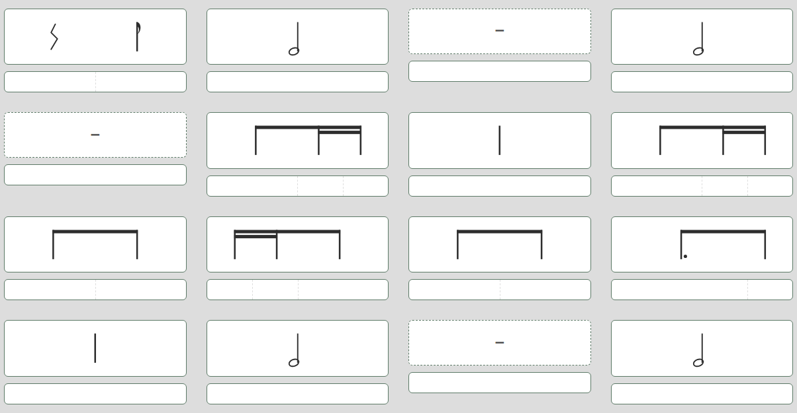

### One Source of Truth for Notation

Every rhythm card's stick-notation SVG and its paired solfège entry card are computed from the same input: a single per-motif table of relative note-duration weights. Column boundaries, stem positions, and beam groupings are all derived proportionally from that one table — meaning the rhythm card's third stem and the solfège card's third entry column are guaranteed to land in the same place, for _any_ motif, without two separately-authored assets ever needing to be hand-tuned into agreement. This was the fix for a real bug during development: tied motifs spanning two grid boxes (a dotted note whose sound continues into the next box) initially left the solfège card with no entry column at all in the continuation box, because nothing tracked which portion of a motif's duration belonged to which box. The fix generalised the whole rendering system rather than patching the one motif that exposed the problem.

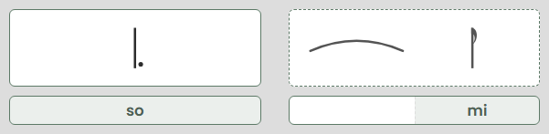

### Workspace Pagination for Longer Phrases

An 8-bar exercise in a busy metre can generate more individual rhythm cards than comfortably fit on one screen. Rather than shrinking cards to force a fit, or truncating longer phrases, the workspace paginates horizontally — dot navigation moves between pages of the same exercise, keeping every card at a consistent, legible size regardless of how long the underlying phrase is.

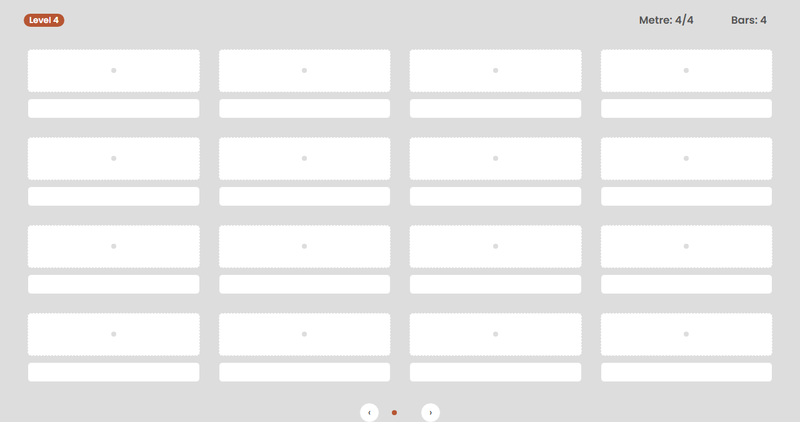

### Tap-and-Hold Focus Editing

Selecting the correct card from a scrolling reel on a small touchscreen is a fundamentally different interaction problem than doing it with a mouse. Tap-and-hold on any workspace card opens a focused "vignette" view — the single card enlarged, with its own mirrored reel for making a selection up close — before returning to the full board. A deliberate second interaction mode for a problem that a single, one-size-fits-all interface handles poorly.

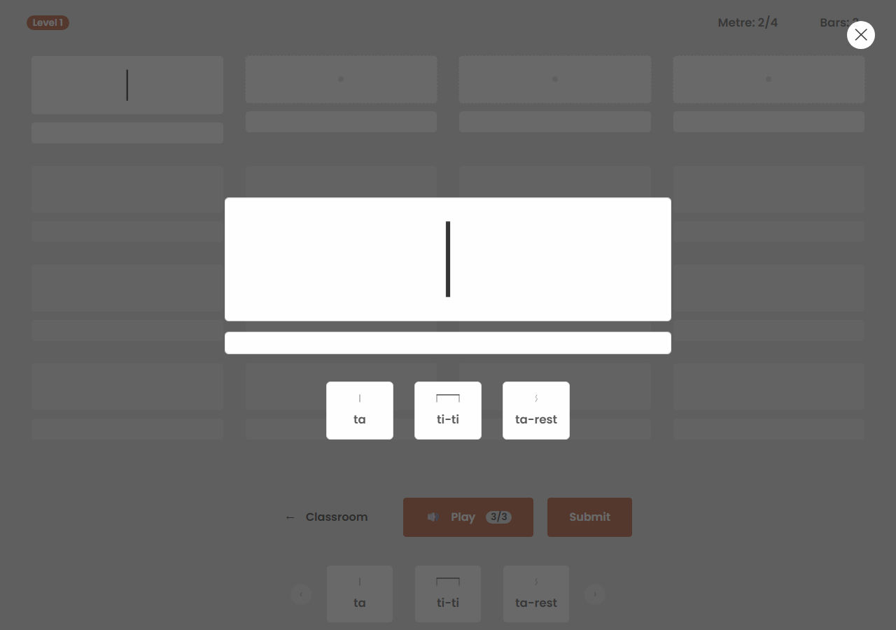

### Irregular Metres Without a Second Generator

5/8 and 7/8 don't divide into equal beats, so they're conventionally grouped — 2+3, or 2+2+3 — rather than treated as a flat tick count. Rather than building a dedicated irregular-metre generator, each group in the pattern is simply one more call to the existing bar generator: a "2" group is exactly one simple-time beat's worth of content, a "3" group is exactly one compound-time beat's worth, and both pools of content already existed. Architectural economy over building a parallel system for what turned out to be the same underlying problem at a smaller scale.

### Deliberately Unforced Cadence Logic

V1's own stated pedagogical principle — real motifs from curated pools, not arbitrary randomness — extends into a specific, deliberate constraint on the melodic engine: sparse early tonesets (a two-note so-mi exercise, for instance) are _not_ forced to resolve onto a "correct" final note. Real early-repertoire songs built from just two or three notes don't reliably end the same way, because there isn't yet a strong enough tonal centre established to make one ending more "correct" than another — forcing a resolution rule onto content that thin would have been mathematically tidy and musically dishonest. Cadence-forcing only activates once a level's toneset is rich enough to genuinely support the concept of a tonic.

### Mastery-Gated Progression

Practice Room has no level switcher of its own — a session always begins at Level 1, and advancing to the next level happens only by completing three exercises correctly in a row, surfaced through the celebration modal. This is a deliberate constraint, not a missing feature: it prevents a student from skipping ahead to content they haven't actually demonstrated mastery of. Classroom's level dropdown is a separate, unrelated control — it filters which level's curriculum guide and per-level panels are currently being viewed, with no effect on the active practice session at all.


### Preparation, Presentation, and Practice Tabs

Classroom's level content originally stacked five panels — Presentation, Rhythm Workshop, Melodic Workshop, Example, Interval Detective — as one continuous scroll beneath the Level Guide, alongside a static Kodály reference matrix. Nothing distinguished "the bit that names what's new" from "the bit you actually drill," so returning to a specific level meant scrolling and re-reading headings to relocate whichever panel was actually relevant.

That flat list is now a three-tab folder strip — Preparation, Presentation, Practice — mirroring how these ideas are actually taught: experienced first, named second, and practised for as long as you like afterward. Presentation keeps its existing content unchanged; Practice bundles the four hands-on drills (Rhythm Workshop, Melodic Workshop, Example, Interval Detective) behind a single tab, so switching between "here's what's new" and "go practise it" is one click rather than scrolling past unrelated content to find it. Preparation shows a plain "not yet available" state at every level — a genuine placeholder, not a hidden bug, since no pre-exposure content has been built for any level yet. Each tab is coloured from the existing accessible palette (deep gold/tangerine/teal, no new tokens), and an active tab's fill merges directly into its panel below with no seam, reading as one continuous surface rather than two boxes touching. The now-redundant reference matrix — fully superseded by Presentation's real generated notation — was deleted entirely rather than kept in sync as a second source of truth.


### Presentation

Behind its own tab, Presentation is the explicit "here's what's new" moment for whichever level is selected, isolating only the motif(s)/syllable(s) genuinely introduced at that level rather than its full cumulative pool. Rhythm content renders as real stick notation (the same `renderRhythmSVG` the practice reel itself uses, not a separate illustration), and melody as the same colour-coded solfège circles used throughout the app, sorted low-to-high by pitch rather than left in their pedagogically-ordered (not pitch-ordered) source data. The two tracks are independent: Level 4 has new rhythm motifs but no new syllable, and Presentation says so plainly instead of rendering an empty circle row. Levels 5-9 show a clear "not yet available" state rather than a broken or hidden section, since those levels' generation algorithms don't exist yet.

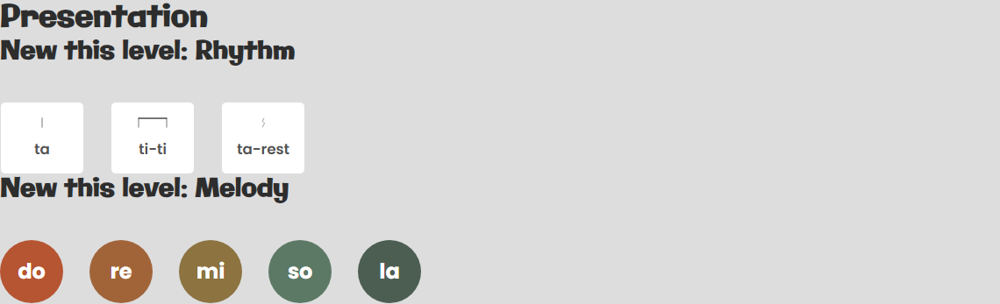

### Rhythm Workshop

Behind the Practice tab, a select-to-drill reel of that level's new rhythm motifs, with a "Play Ostinato" button that loops the selected motif a fixed number of times via `AudioEngine.playOstinato` — deliberately simpler than the Practice Room's `playSequence`, since there's no bar/form/cadence structure or count-in to schedule, just "this one thing, repeated." Motifs are grouped under Simple Time / Compound Time headings (`MOTIF_LIBRARY[id].type`, already stored per motif) rather than one undifferentiated row, so metre membership reads at a glance. A motif tied across two grid boxes (`tum-ti`, `syncopa`) renders both — the same tie-arc continuation the main Practice Room workspace already draws correctly — rather than silently showing only the first box, a rendering-only gap fixed at its shared root so Presentation's copy of the same motifs is correct too.

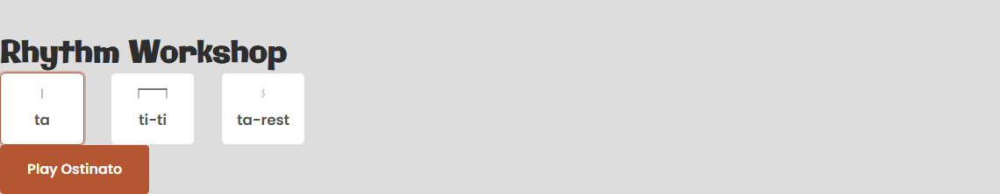

### Melodic Workshop

A keyboard, not a drill reel: every syllable in the level's **cumulative** toneset (not just what's new) renders as its own always-playable pad, click one and hear it immediately via a new, deliberately Transport-free `AudioEngine.playNote` — no selection state, no repeat count. A lone new-to-level syllable had no melodic context on its own in the original select-then-loop design (Level 3's `fa` specifically is close to useless in isolation); showing the full toneset a student already knows, free to explore, replaces that entirely rather than patching it.

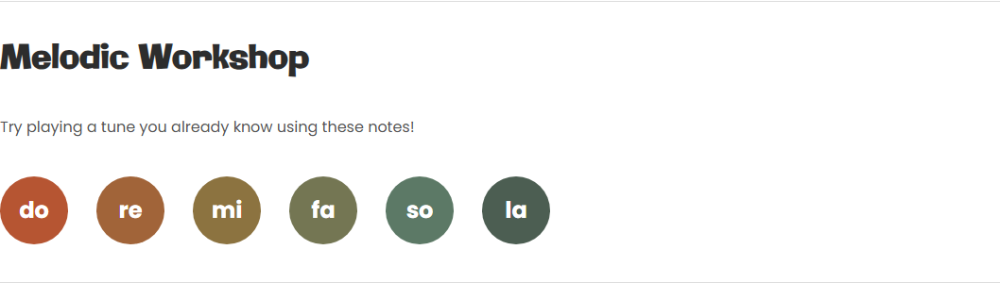

### Example

A fourth Classroom panel, listen-only: Play generates a fresh phrase from that level's real generator — `generateRhythmTimeline`, `countSoundingNotes`, and `generatePitchLine`, the exact same functions Practice Room's dictation engine runs — and plays it straight through with `AudioEngine.playSequence`, no workspace, no submission, no evaluation. Each click regenerates rather than replaying the same phrase, since there's no fixed target here to stay in sync with; the resolved metre and bar count render as a plain confirmation that something new actually played.

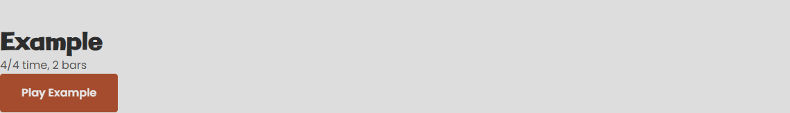

### Interval Detective

The fifth and final Classroom panel: Play draws two syllables from the level's full cumulative toneset (not just what's new that level), sounds them in a random ascending or descending order, and the student picks the matching pair from the same colour-coded solfège circles used throughout the app — no text-based answer, staying in the app's existing visual vocabulary. Guessing auto-evaluates on the second distinct pick rather than needing a separate submit button, a deliberately lighter interaction than Practice Room's multi-slot dictation flow. A new semitone-distance-to-interval-name lookup (0–12 semitones, reusing the same offsets `SOLFEGE_DEGREES` already stores for movable-do resolution) names the interval in the feedback either way — "so → mi... Minor 3rd" — turning a right/wrong signal into an actual piece of ear-training vocabulary.

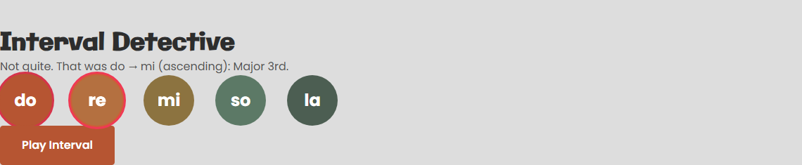

<p align="right">(<a href="#top">Back to top</a>)</p>

## 6. <a name="deployment"></a> 🌐 Deployment Guide

This project was developed using Git version control and is hosted on GitHub. It has been deployed as a live web application using **GitHub Pages**.

### Build Step (New in Version 2)

Unlike V1's single static stylesheet, V2's CSS is generated from a token pipeline and **will not render correctly if this step is skipped** — every colour, spacing, and typography value in the compiled `variables.css` depends on it.

1. **Install dependencies:** `npm install` (Node.js required — this is now a genuine prerequisite, not just a convenience option for local serving).
2. **Compile the design tokens:** `npm run build:tokens`. This reads `design-tokens.json` and generates `src/css/global/variables.css`. Re-run this any time `design-tokens.json` changes — the generated file is never hand-edited directly.
3. **Bundle the CSS:** `npm run build:css`. `index.css`'s 26 separate `@import`s are all render-blocking — a Lighthouse audit confirmed this was the single biggest performance cost on every page. `build-css.js` reads that same import chain and concatenates every file it references, in order, into `src/css/bundle.css` (each file's content wrapped in the `@layer` its `@import` already declared, so cascade order is unaffected), and the HTML pages link to the bundle rather than `index.css` directly. `index.css` itself is untouched and stays the source of truth for adding or reordering imports — re-run this script any time it changes.

### Deployment Steps

To deploy the site to GitHub Pages:

1. **Repository Access:** Click on the Settings tab located in the repository's main navigation bar.
2. **Pages Configuration:** In the left-hand sidebar, click on **Pages**.
3. **Source Selection:** Ensure the "Source" dropdown is set to **Deploy from a branch**.
4. **Branch Targeting:** Select the `main` branch, folder set to `/ (root)`.
5. **Save & Build:** Click **Save** to trigger the GitHub Actions build workflow.
6. **Live Link:** Appears at the top of the settings page after a few minutes.

Note: the compiled `variables.css` and `bundle.css` should both be committed to the repository (not generated on the fly by GitHub Pages, which doesn't run a build step) — run the build steps locally and commit the output before pushing.

### Local Deployment (Cloning)

1. Navigate to the GitHub repository and click the green `<> Code` button to copy the HTTPS URL.
2. Open your terminal and run: git clone `https://github.com/StockoL/solfaic.git`
3. Run the **Build Step** above (`npm install`, then `npm run build:tokens` and `npm run build:css`) before doing anything else.
4. Serve the project through a real local server — **this is no longer optional for a second, more fundamental reason than V1's Web Audio permissions requirement.** V2's JavaScript is loaded via ES modules (`<script type="module">`), which fail outright over the `file://` protocol regardless of audio permissions. Opening `index.html` by double-clicking it will not work at all.

### ⚡ Quick Local Spin-Up Alternatives

From the cloned root directory, after completing the Build Step above:

- **Node.js (via npx):** `npx static-server` or `npx http-server`
- **Python 3.x:** `python -m http.server 8000`
- **VS Code:** the Live Server extension remains the simplest option for active development

### 🚀 Quick Start

The fastest path from a fresh clone to a running, linted, tested build:

```bash
npm install
npm run build:tokens && npm run build:css
npx http-server -p 8080          # or any static server — see above
npm run lint
npm test                          # see "Running the Suite Locally" below for details
```

### ✅ Deployment Verification

| Item                                | Status                | Notes                                                                                                                                        |
| ------------------------------------ | ---------------------- | --------------------------------------------------------------------------------------------------------------------------------------------- |
| Live URL reachable                   | ✅ Verified 2026-07-21 | `https://stockol.github.io/solfaic/` returns `200 OK`, `Content-Encoding: gzip`, matching the compression note in the Lighthouse section above. |
| Deployed build matches `main`        | ☐ Pending each release | Re-confirm the committed `bundle.css`/`variables.css` were rebuilt (see Build Step) before pushing, since GitHub Pages serves them as-is.       |
| Cross-browser spot check (desktop)   | ☐ Pending              | Load the deployed URL itself (not just localhost) in Chrome, Firefox, and Safari.                                                              |
| Cross-device spot check (mobile)     | ☐ Pending              | At least one real iOS and one real Android device against the deployed URL — this is also where the iPhone grid bug (Known Issues) would need chasing directly. |

### 📋 Release Checklist

Before shipping a new version:

1. `npm run lint` — must exit clean.
2. `npm run verify:engine` — engine harness must report 0 failures.
3. `npm test` — full Playwright suite, all 5 browser/device projects.
4. `npm run build:tokens && npm run build:css` — rebuild, then confirm `src/css/global/variables.css` and `src/css/bundle.css` show as changed (or unchanged, if nothing token/import-related moved) before committing.
5. Spot-check the deployed URL after the Pages build finishes (see Deployment Verification above).
6. Update the Development Log with anything notable from this release.

<p align="right">(<a href="#top">Back to top</a>)</p>

## 7. <a name="credits"></a> 🤝 Credits & Acknowledgements

- **Tone.js (v14):** External framework used to script the transport sequence engine scheduler, now driving both rhythm playback and movable-do pitch resolution.
- **Louis Hoebregts ([CodePen: Mamboleoo](https://codepen.io/Mamboleoo/pen/BxMQYQ)):** Source reference for the homepage's ambient hero particle-field animation concept, cited from V2's earliest planning stage.
- **Josh Comeau ("Whimsical Animations" Course):** Directly inspired the confetti celebration and pushable CTA button's spring physics — deliberately reserved for once-per-page hero moments in V2, rather than applied throughout.
- **Andy Bell (CUBE CSS Methodology):** The architectural foundation for the entire V2 presentation layer — Composition, Utility, Block, Exception, and native CSS cascade layers replacing V1's single stylesheet.
- **LooseLeaf-ui (Prior Personal Design System):** The source library for V2's Compositions and several Blocks, adapted to Solfaic's specific tokens, semantics, and DOM structure rather than used verbatim.
- **Every Layout (Heydon Pickering):** Principles of intrinsic web design that originally informed V1's layout thinking, and which LooseLeaf-ui's own Compositions are themselves built on — a lineage carried forward into V2 rather than a direct source this time.
- **Utopia.fyi:** Generated the fluid type and space scales driving V2's entire typography and spacing system.
- **Phoenix Collective (Cyrilla Rowsell) / British Kodály Academy:** Source curriculum for the melodic engine's tonesets, cadence logic, and rhythm vocabulary across all 9 modelled levels — the pedagogical backbone of the entire melodic system.
- **Google Fonts (Galindo, Poppins):** V2's typeface pairing, replacing V1's unspecified system font stack. Both distributed under the SIL Open Font License 1.1 — full attribution and licensing detail in the [Lighthouse Scores](#testing) section, alongside the self-hosting process itself.

**Custom vs. external code, stated plainly:** every line under `src/js/` and `src/css/` — the rhythm and melodic engines, the state/view logic, the CUBE CSS architecture and design tokens — is original to this project. The one external runtime dependency is Tone.js, loaded via CDN in `classroom.html`/`practice.html` with an inline comment crediting it at the point of inclusion; everything else listed above is a design, methodology, or pedagogical source that _informed_ the build rather than code pulled in directly.

Licensed under the [MIT License](./LICENSE).

### AI Pair Programming & Academic Integrity

Artificial Intelligence (LLMs) was utilised strictly as a "Pair Programmer" and strict linter throughout the development lifecycle to accelerate cross-browser debugging, reflow profiling, and formatting, ensuring absolute human ownership and comprehension of the overarching engine code.

Two specific blocks in the codebase are marked `AI-Attribution` inline rather than left unmarked like the rest — as a learner, these are cases where I genuinely wouldn't have arrived at the solution unaided, and I'd rather credit that honestly than claim it as unaided work I later happened to also understand:

- **`src/js/audio.js`, inside `resolveSolfegeToNote()`:** the regex `/^([A-G][#b]?)(\d+)$/` that splits a Tone.js note string like `"Eb4"` into its pitch-class letter (with optional accidental) and octave digits, in one pattern with the capture groups destructured directly. The rest of the function — converting that pitch class to a 0–11 chromatic index, adding the solfège syllable's semitone offset, then using `Math.floor`/modulo on the total to work out both the resulting note *and* whether it crossed an octave boundary — is the actual movable-do resolution logic, and it only works because this regex hands it a clean pitch-class/octave split to begin with.
- **`src/js/core.js`, inside `resolveSolfegeColor()`:** the `color-mix(in srgb, var(--color-solfege-${above.token}) ${towardAbovePercent}%, var(--color-solfege-${below.token}) ${100 - towardAbovePercent}%)` template literal that blends two solfège anchor colours. Each of the 7 diatonic syllables has a fixed colour; a chromatic syllable not among them gets its colour computed on the fly — nearest anchor below and above by semitone degree, how far between them it sits as a percentage, then handed straight to CSS's native `color-mix()` so the actual RGB blending happens in the browser's CSS engine rather than being precomputed in JS. No chromatic syllable's colour is ever hand-picked or stored; the blend is entirely degree-driven.

This is an ongoing thing, not a closed list — these are the two I've identified so far while learning to recognise this class of solution myself; more may get the same honest attribution as I find them.

### Technologies Used

- **HTML5:** Semantic, accessible markup across three purpose-built pages.
- **CSS3:** Custom properties, CSS Grid, native cascade layers (`@layer`), and `color-mix()` for the accessible palette derivation.
- **JavaScript (ES6+ Modules):** A dual-engine (rhythm + melodic) generative architecture with a fully separated state/view/engine structure.
- **Tone.js (v14):** Web Audio API synthesis and scheduling, extended for movable-do pitch resolution.
- **Node.js:** Powers the design-token compiler (`design-tokens.json` → `variables.css`).
- **Inline SVG:** Rhythm notation and solfège entry columns generated programmatically from shared duration data, rather than hand-authored per motif.
- **Git & GitHub:** Atomic commit history and cloud distribution.

### 📂 Repository Structural Layout

```text
├── .github/workflows/         # CI — runs the Playwright suite on push
├── LICENSE                     # MIT
├── design-tokens.json         # Single Source of Truth — colour, type, space, motion tokens
├── build-tokens.js            # Token compiler (Vanilla Node.js)
├── build-css.js                # CSS bundler — concatenates index.css's @import chain (Vanilla Node.js)
├── eslint.config.js             # ESLint flat config
├── package.json                # Build & test commands (build:tokens, build:css, verify:engine, lint)
│
├── index.html                  # Home
├── classroom.html              # Classroom — curriculum reference & level guides
├── practice.html               # Practice Room — the dictation engine itself
├── 404.html                     # GitHub Pages fallback
│
├── docs/
│   ├── wireframes/             # Initial UI concepts
│   ├── architecturemaps/       # Early Mermaid flowcharts from initial project conception
│   ├── screenshots/             # UI captures referenced throughout this README
│   └── animations/              # Confetti / frustration-shake source clips
│
├── tests/
│   ├── engine-verification.mjs  # Node harness — pure-function engine checks (npm run verify:engine)
│   └── solfaic.spec.js           # Playwright E2E suite
├── playwright.config.js         # 5 browser/device projects (Chromium, WebKit, Firefox, Mobile Chrome, Mobile Safari)
│
└── src/
    ├── css/
    │   ├── index.css           # Orchestrator — declares the cascade layer order, dev-time source of truth
    │   ├── bundle.css           # Auto-generated by build-css.js — what the HTML actually links to
    │   ├── global/              # Reset, base typography, auto-generated variables.css
    │   ├── compositions/        # 10 layout primitives (Cluster, Spread, Grid, Reel...)
    │   ├── blocks/               # Visual components (Button, Nav, Accordion, Modal...)
    │   └── utilities/            # Single-purpose overrides
    │
    └── js/
        ├── app.js                # Event wiring & bootstrap
        ├── core.js               # DOM rendering (view layer)
        ├── engine.js             # Rhythm + melodic generation (pure functions)
        ├── data.js               # Motif library, curriculum data, design tokens' JS counterpart
        ├── audio.js              # Tone.js playback, movable-do resolution
        ├── state.js              # Single source of truth for session state
        └── rhythm-notation.js    # Generates rhythm SVG + solfège columns from shared data
```

<p align="right">(<a href="#top">Back to top</a>)</p>

## 8. <a name="dev-log"></a>🏗️ Development Log & Engineering Phases

V2's build ran in five loosely sequential phases, each building directly on the last rather than as a flat feature list:

1. **Rhythm engine extension** — carrying V1's Markov-driven bar generator forward, then adding anacrusis (pickup-beat) support and irregular-metre grouping (5/8, 7/8) without a second, parallel generator.
2. **Melodic engine & the movable-do bridge** — a curriculum-grounded pitch generation layer built onto the same architectural pattern as the rhythm engine, plus the resolution step (`audio.js`) that turns relative solfège tokens into real, keyed notes only at playback time.
3. **CUBE CSS rebuild & the accessible palette rollout** — migrating from V1's single stylesheet to a four-layer cascade architecture, then auditing and darkening every text-bearing button/badge/status colour to a verified WCAG AA 4.5:1 minimum, while deliberately keeping the hero particle field and focus ring on the brighter, pre-darkened tokens.
4. **Two-phase workspace & shared notation rendering** — rebuilding the practice workspace around a metre-aware grid and a single shared duration table that drives both the rhythm SVG and the paired solfège entry columns, so the two never drift out of alignment.
5. **Test harness build-out** — a Node harness for the two pure-function engines (`tests/engine-verification.mjs`), followed by a full Playwright rewrite of the E2E suite to match the two-phase rhythm/pitch flow and the current page structure.
6. **Classroom content sprint** — Presentation, Rhythm Workshop, Melodic Workshop, Example, and Interval Detective, all built on existing generated content or new engine logic rather than needing real repertoire or video. This fulfils "introductory learning content for each level" much as V2's initial planning document scoped it from day one — video explanations aside, which remain deferred pending real recorded material — rather than a new idea introduced at this stage. A new `AudioEngine.playOstinato` method and a small level-of-introduction/interval-naming data layer (`introducedAtLevel`, `getNewlyIntroducedSyllables`, `INTERVAL_NAMES`) underpin all five, wired to Classroom's level dropdown via a `classroom-level-changed` event rather than a direct module import.
7. **Classroom refinement** — three tabs (Preparation/Presentation/Practice) replace the five flat sections and the now-deleted Kodály reference matrix; a rendering-only tum-ti/syncopa bug is fixed at its shared root; Rhythm Workshop is grouped by metre; Melodic Workshop is rebuilt as a click-to-play keyboard on a new, deliberately Transport-free `AudioEngine.playNote`; and Interval Detective's reference syllable now highlights alone.

### Notable Bugs Caught & Fixed

**A recurring theme worth naming explicitly: asynchronicity and shared-state timing.** Several entries below aren't isolated one-off bugs — they're the same underlying class of problem surfacing in different places, because Tone.js playback is inherently asynchronous (`await Tone.start()`, `Tone.Transport`-scheduled events) while the app's own state (`sessionState`, button lock classes, synth voices) is mutated synchronously around it. V1 first hit this as the **Audio-Lock Race Condition**: `triggerReplay()` originally awaited Tone's async boot-up *before* applying the `is-locked` class, leaving a real window (worse on slower devices) where a second click could fire before the UI reflected that playback had already started. The fix — apply the lock synchronously, immediately on click, before anything `await`s — is why `triggerReplay()` in `app.js` locks the button as its very first statement, ahead of the `await AudioEngine.playSequence(...)` call. The same shared-mutable-state hazard reappeared in V2 in a different shape below (**"A new keyboard feature and the scheduled playback engine fought over the same synth voice"**): two independent playback paths — one immediate, one Transport-scheduled — mutating the same monophonic synth's internal timeline from two different call sites. `playStartingNote`'s open, not-yet-fixed risk (see Known Issues) is the same hazard a third time, just not yet observed causing a failure. The `is-locked` CSS state itself (previously unstyled — see the button block's fix) exists specifically so the user has a visible signal for exactly this class of async gap, not just correct-but-invisible internal state.

**Tied motifs left the solfège card with no entry column in the continuation box**

- A motif tied across two grid boxes (a dotted note whose sound continues into the next box) had nothing tracking which portion of its duration belonged to which box, so the solfège card's continuation box rendered with no entry column at all.
- _Fix:_ Generalised the shared rendering system to track duration-per-box explicitly, rather than patching the one motif that exposed the gap.

**Palette darkening had fallout across three derived surfaces**

- Darkening `action-primary`/`action-secondary`/`status-success` for text contrast — the core accessibility fix — had knock-on effects nothing else caught automatically: the pushable CTA's `color-mix()`-derived shadow/edge layers collapsed into a muddy, low-contrast stack; the hero particle field silently inherited the new muted tone instead of staying decorative-bright; and the site-wide focus ring became noticeably less visible.
- _Fix:_ Restored the CTA's 3D depth against the new base colour, and pointed the hero particles and focus ring explicitly at the separate `accent-vivid-*` tokens reserved for decoration, leaving the deep tokens exclusively for text-bearing surfaces.

**Practice Room broke after a dead-code removal**

- Removing the unused V1 onboarding-tour wizard from `core.js` took a live module dependency down with it, breaking Practice Room's boot sequence.
- _Fix:_ Restored the load path without reintroducing the dead tour code.

**Confetti and the celebration modal fought over stacking order**

- The confetti burst originally rendered in front of the celebration modal instead of behind it, and the modal backdrop dimmed the confetti's own colours.
- _Fix:_ Corrected the layering so the modal reads as sitting in front of the burst, with the confetti kept fully coloured.

**The workspace grid didn't follow the exercise's actual metre**

- Early workspace layouts used a fixed column count, splitting bars awkwardly across row boundaries for anything other than common time.
- _Fix:_ Column count is now derived from the live session's `ticksPerBar`, so a 3/4 exercise renders in genuine 3-column rows.

**3/4 exercises rendered dramatically taller than every other metre**

- Fixing the row above surfaced a second-order bug: the Grid composition's default `1fr` columns divide a row's full width evenly by however many columns exist, and 3/4 only fits 3 boxes per row without splitting a bar — so those 3 columns rendered wider than every other metre's 4. Since `.workspace-card--rhythm`'s `aspect-ratio: 4/1` ties height directly to width, that extra width became extra height on every card, compounding across a multi-bar phrase into a workspace that scrolled far longer than the same content needed in any other metre.
- _Fix:_ Column tracks now size against a constant 4-box reference instead of the row's actual column count, so box size stays identical across every metre; 3/4's row is simply narrower and centred rather than stretched.

**A global keyboard shortcut router silently broke native button activation everywhere**

- Practice Room's Space=replay/Enter=submit shortcuts were wired as a page-wide `keydown` listener that called `e.preventDefault()` unconditionally, before checking whether those shortcuts even applied. That suppressed the browser's native Enter/Space-activates-a-focused-button behaviour for every button on every page — including Classroom's own controls — not just the two it was meant for. Only surfaced by testing a real keyboard press directly; a simulated click bypasses native keyboard activation entirely and would have passed regardless.
- _Fix:_ The router now skips entirely when focus is already on a native interactive element (button, link, form control), letting the browser's own correct behaviour apply instead of being overridden.

**tum-ti and syncopa silently dropped their second box in Presentation and Rhythm Workshop**

- Playback was already correct — this was a rendering-only gap. Both motifs are tied across two grid boxes, but the shared display-pad builder both panels use only ever called the rhythm-SVG renderer once, for box A, with nothing checking whether a motif actually needed a second box at all. The main Practice Room workspace already handled this correctly for the exact same motifs; the Classroom display path just never reused that logic.
- _Fix:_ Wraps the existing single-box builder with a second, purely decorative box (the same tie-arc rendering path the workspace uses) whenever a motif is tied, rather than duplicating the fix per call site — `too`/`too-rest` also span two boxes but aren't tied, and correctly keep their single-box display, since their held notehead already shows the full duration on its own.

**A new keyboard feature and the scheduled playback engine fought over the same synth voice**

- Caught manually clicking through the new Melodic Workshop keyboard: click a key, then trigger a scheduled sequence shortly after (Play Ostinato, Play Interval, real dictation playback), and Tone.js throws "Start time must be strictly greater than previous start time." The keyboard's immediate, unscheduled note-trigger and the sequencer's Transport-scheduled ones were sharing one monophonic voice, and the two playback models don't share a timeline.
- _Fix:_ Gave the keyboard its own dedicated synth instance rather than trying to keep one shared voice's timing consistent across an immediate and a scheduled playback model.

**The Classroom tab strip ran off-screen on narrow viewports instead of wrapping**

- `.classroom-tabs` declared its own `display: flex` with no wrap, so Preparation/Presentation/Practice tried to stay on one line regardless of available width and overflowed the viewport on mobile.
- _Fix:_ Added the existing `.cluster` composition class to the tab strip instead of hand-rolling a wrap rule — the same flex-wrap layout primitive already used for every reel/group elsewhere in the app, so Practice now drops to a second row exactly when it stops fitting.

**Interval Detective's reference-syllable highlight was too brief to register**

- It reused the shared `is-pulsing` beat-flash Rhythm Workshop's ostinato drives, a CSS animation tuned for a quick per-beat pulse (`--dur-base`, 250ms) — correct for that purpose, too fast to actually notice as "here's your reference note" here.
- _Fix:_ A new `is-highlighted` class held for a full 2s on a JS timer (`highlightReferencePad`), applied directly in the "Play Interval" click handler rather than through the shared `pulseOstinatoTarget`/`audio-ostinato-beat` mechanism — decoupled entirely so Rhythm Workshop's own quick pulse is untouched.

**Practice tab panels touched the separator rule of the panel after them**

- `.classroom-panel`'s border lives on the top edge of the NEXT panel, not the bottom of the current one, and only `padding-block-start` existed — so a panel's own last content (Melodic Workshop's solfège circles, Example's Play button) sat flush against the following panel's border line.
- _Fix:_ Changed to `padding-block` (both sides) so each panel keeps clear space before the next one's separator, not just after its own.

**classroom.html's Lighthouse score stayed the worst of the three, and my first fix for it didn't move it at all**

- 87, against index.html's 93 and practice.html's 91 — even after CSS bundling and font self-hosting had already landed. I ran a real Lighthouse audit rather than guess why, and read `unused-javascript`/`unminified-javascript` flagging `core.js` and Tone.js as the biggest JS offenders. My first theory: every page was loading the exact same `app.js`, so index.html (a marketing page with no exercises) was downloading and parsing the entire Practice Room engine — `engine.js`, `audio.js`, `rhythm-notation.js` — for nothing. I split it into three lighter entry points (`home-entry.js`, `classroom-entry.js`, and `app.js` kept for practice.html), each importing only what its own page's DOM actually has to attach to.
- I re-ran the audit before trusting the fix. All 160 tests still passed and real bytes dropped (11KB less unminified JS on classroom.html), but FCP, LCP, and the score itself — 87 — didn't move outside noise. The JS split was correct, just not the actual bottleneck.
- Went back to the same audit's `render-blocking-insight` finding, which I'd read past the first time: `bundle.css` itself, one universal ~90KB file shipped identically to all three pages, was costing classroom.html ~1954ms of render-blocking time on rules it doesn't even use (`workspace.css`, `celebration-modal.css`, and others that are exclusively Practice Room's). Bundling had fixed the *request count* (32 imports down to 1) but never addressed the fact that all three pages were still shipping each other's CSS.
- _Fix:_ Audited which of the 16 block files each page's DOM genuinely needs — checking actual `className`/`classList` assignments in the JS, not just filenames, since a couple of assumptions turned out wrong on inspection (Classroom's Workshops share `motif-pad.css`/`badge.css` with Practice Room's reel; `workspace.css` really is Practice-only, despite a comment in `classroom.js` that mentions `.workspace-box` in passing) — then split `index.css`'s single import chain into three page-specific entries (`src/css/entries/{home,classroom,practice}.css`), and generalised `build-css.js` to build all of them from one script run instead of assuming a single bundle. classroom.html went from 87 to 93, index.html from 93 to 98, practice.html from 91 to 94, confirmed with a real before/after Lighthouse run rather than assumed from the byte-size drop alone.

The "Video coming soon" placeholder has also been deleted from each Level Guide (`classroom.html`'s `.level-guide__video` mount points and their CSS) — dead weight now the Presentation/Practice panels carry real generated content instead.

<p align="right">(<a href="#top">Back to top</a>)</p>

## 9. <a name="testing"></a> 🧪 Testing & Quality Assurance Portfolio

This section outlines the holistic verification suite executed to guarantee the engineering integrity, mathematical precision, and cross-platform accessibility of Solfaic.

**Key user journeys, screenshotted:** the three states most worth seeing directly — a first practice attempt, an incorrect submission, and the rhythm→pitch phase transition — are already captured in [Core Features](#features) above: the [Level 1 workspace grid](./docs/screenshots/v2_workspace_metre_grid.png), the ["Not quite!" escalating feedback modal](./docs/screenshots/v2_escalating_feedback.png), and the [Starting Note phase transition](./docs/screenshots/v2_two_phase_starting_note.png), respectively.

### Why Playwright, and Why Tests Came First

**Why Playwright, not Jest.** This was actually decided back in V1, for a reason that's still just as true now: Jest runs in a simulated Node environment (`jsdom`) with no real soundcard and no real `window.AudioContext`. Getting Jest to touch anything audio-related at all means mocking the entire Web Audio API — which V1's own README called out plainly as "an industry anti-pattern," and V2 inherited that reasoning rather than re-litigating it. Every race condition documented in this README's bug log (the audio-lock race, the keyboard/scheduled-playback synth conflict) is a *timing* bug against a *real* Tone.js transport — a mocked audio context wouldn't have real timing to get wrong, so it wouldn't have caught any of them. Playwright spins up an actual Chromium/WebKit/Firefox engine with a real audio stack, so the tests are exercising the same failure modes a real user actually hits.

**The V1 lesson, with the real numbers.** V1 built the rhythm engine, the DOM rendering cycle, event handling, and the full Tone.js audio integration across 88 commits over 22 days (`78e37f5`, 2026-06-05, through `4987e3f`, 2026-06-27) with zero automated tests. `4987e3f`'s own commit message says what happened next: `test(e2e): implement Playwright suite, patch audio UI race condition, and document QA strategy` — the very first time any test ever ran against this codebase, it caught a real concurrency bug (the audio-lock race condition) that had been sitting undetected in shipped code for over three weeks. That's not a hypothetical argument for testing early; it's what actually happened the one time testing was left until the end.

**How V2 actually did it differently.** Tests weren't planned upfront as a grand strategy and then executed — each mechanism was reached for at the point in development where it was the natural fit. The Node harness (`tests/engine-verification.mjs`) exists because the rhythm/melodic engines are pure functions with no DOM dependency, so `55542bd` added it directly alongside that engine work rather than routing everything through slower E2E tests. Playwright coverage grew the same way: `34c7e7e` (`test: update the Playwright suite for the Classroom sprint`) landed the same session as the five Classroom panels it covers, not weeks after — and when a test's own assumption turned out to be wrong (a tab-wrap test that assumed a specific row split, which held on Windows but broke on Ubuntu's font metrics in CI), `c802d5d` fixed the *test's* assumption in direct response to that real CI failure, rather than leaving it broken or writing it once and never revisiting it. Tests are part of the same commit as the feature they check, not a separate phase that happens afterward.

### 1. Engine Verification (Node Harness)

The rhythm and melodic engines are pure functions with no DOM dependency, so they're verified independently of the browser via a lightweight Node harness (`tests/engine-verification.mjs`) rather than routed entirely through slower, flakier E2E tests. This is where the genuinely new V2 logic — anacrusis gating, cadence-forcing behavior, movable-do resolution — is actually checked, not just exercised incidentally through UI clicks.

- `MOTIF_LIBRARY` **internal consistency:** every motif's `playback` array sums to its declared `ticks` value in quarter-note-equivalent beats, and every `restMask` (where present) matches its `playback` array's length. Catches a motif definition being silently wrong before it ever reaches generation.
- **Rhythm generation, 200 trials per level:** confirms every generated motif is drawn from that level's allowed pool, totalTicks correctly accounts for an anacrusis pickup beat when present, anacrusis-gated levels see it appear probabilistically (neither always nor never), and cadence-enforced levels genuinely end on a CADENCE_MOTIFS member.
- **Irregular metre grouping (5/8, 7/8):** confirms both the default and contrasting-variant groupings sum to valid tick totals — standalone-verified ahead of being wired into a live level.
- **Pitch generation, 200 trials per level:** confirms generated pitch lines stay inside the active toneset, tonics are drawn from the allowed set, and — critically — Level 1's final note varies meaningfully across trials rather than clustering on one value, confirming cadence-forcing is genuinely disabled there, not just weighted low.
- `countSoundingNotes` ↔ `generatePitchLine` pairing, 100 trials: confirms the pitch line's length always matches the rhythm timeline's actual sounding-note count, `restMask`-aware, across all four playable levels.
- `resolveSolfegeToNote`: confirmed against 6 known solfège-token/tonic pairs, plus a full accounting check on `SOLFEGE_DEGREES` (14 syllables: 7 diatonic, upper `do'`, and 6 chromatic alterations).
- **Sample phrase printout:** 5 generated rhythm+pitch phrases per level logged in full, for a human legibility check numbers alone can't provide — does a generated Level 2 phrase actually look like something a Level 2 student would plausibly be asked to sing?
- `introducedAtLevel` **tagging:** every `MOTIF_LIBRARY` entry's level tag is checked against `MOTIF_POOLS`' own pool-of-origin, and that all 23 motifs are accounted for exactly once.
- **Melodic level-of-introduction, 4 levels:** `getNewlyIntroducedSyllables` matches known values exactly — Level 3 introduces only `fa`, Level 4 introduces none at all despite having new rhythm content, confirming the two tracks are genuinely independent.
- **Interval Detective, 200 trials per level:** `pickIntervalPair` always draws two distinct syllables from the level's cumulative toneset, in both ascending and descending order across trials; `resolveIntervalName` checked against known semitone distances; `evaluateIntervalGuess` confirmed order-independent and rejecting of wrong/incomplete guesses.

### 2. Automated End-to-End Testing (Playwright)

Runs across five browser/device configurations — desktop Chromium, WebKit, and Firefox, plus Mobile Chrome (Pixel 5 viewport) and Mobile Safari (iPhone 12 viewport, WebKit engine) — via `playwright.config.js`, continuing V1's original commitment to verifying the responsive "Sponge" layout actually holds up under real engine differences, not just Chromium alone.

- **A note on testing generative UI:** rhythm and pitch generation draw from `Math.random()` at every step, so the exercise a test needs to solve correctly is normally unknowable from outside the page. The suite solves this by forcing `Math.random` to a constant via `page.addInitScript()` before navigation — every "random" draw becomes reproducible, so re-invoking the same generator function reveals the exact target the live page is already holding, without needing to inspect or mock internal state directly.
- **Initialization & UI Routing:** confirms Practice Room boots to Level 1 defaults with a populated reel; confirms the level dropdown, now relocated to Classroom, correctly filters the level guide to a single level's content.
- **Input & Interaction Mechanics:** motif pad clicks fill the next open slot; number-key shortcuts and Backspace correctly inject and clear motifs.
- **Validation & Error Workflows:** an incomplete board triggers the empty-panic shake; a complete submission runs evaluation, with feedback landing as a `data-feedback` attribute on the workspace box (updated from an earlier class-based approach, following the two-phase rhythm/pitch rework).
- **Audio Context & Thread Locking:** playback correctly locks the replay button against double-firing; exhausting the listen budget (`maxPlays`) shows the out-of-plays modal rather than a native `alert()` (the button's own `pointer-events: none` lock makes it unreachable to a real click by then, so the guard is exercised via a direct event dispatch — the same defensive path a bypass would take); a stubbed `AudioEngine.playSequence` rejection confirms a failed playback unlocks the UI and shows an audio-error modal, rather than leaving the board locked forever.
- **Two-Phase Rhythm → Pitch Flow:** a correct rhythm submission triggers the Starting Note modal, swaps the reel from rhythm motifs to solfège syllables, and leaves the confirmed rhythm boxes visible but read-only while the pitch phase is worked.
- **Escalating Feedback & Remediation:** a first wrong submission shows the "Try Again" modal without disturbing the streak; a second wrong submission on the same still-incorrect board names what to practise, reveals the correct answer on the board, and resets the exercise.
- **Solfège Card Colours:** every reachable syllable resolves to a real, non-empty colour, and no two syllables active in the same toneset ever share one — confirming the palette reads as genuinely distinguishable, not verified by contrast math alone.
- **Metre-Aware Workspace Grid:** the grid's actual column count is re-derived independently from the live session's `ticksPerBar` and compared against the page's rendered `--grid-placement`, confirming bars pack multiple-per-row where they fit rather than always reserving one row per bar.
- **Classroom Level Panels:** the Preparation/Presentation/Practice tabs switch correctly, Preparation shows its unavailable state at every level (not just 5+), and the tab strip itself wraps to a second row on a narrow (320px) viewport rather than overflowing — bounding-box positions confirm Practice actually drops below Preparation/Presentation instead of running off-screen. Presentation, both Workshops, Example, and Interval Detective are verified per level — not just that markup renders, but that audio actually plays the intended content. `AudioEngine.playOstinato`/`playNote`/`playSequence` are intercepted directly on the page's live module instance (a dynamic `import()` inside `page.evaluate` resolves to the same cached ES module the app itself is running, so the spy sees real calls, not a mock standing in for untested code) to confirm the exact motif/syllable/interval pair passed matches what's on screen, rather than only checking "some call happened." Also covers Level 4's "nothing new this level" message (distinct from the Level 5+ unavailable state), a real keyboard-press regression test for the Workshop pads' Space-key activation, a tum-ti/syncopa regression test locking in that only tied motifs get a second box, Rhythm Workshop's Simple/Compound grouping, Interval Detective's reference-only highlight held for a full 2s (`playOstinato` mocked to sidestep a real, pre-existing WebKit/Tone.js scheduling error unrelated to the fix being tested — see Known Issues), and that Practice tab panels keep clear space before the next panel's separator rule rather than touching it.

### Running the Suite Locally

```bash
npm run verify:engine                    # Node engine harness — generation/invariant checks
npx playwright install                   # one-time browser download (Chromium, WebKit, Firefox)
npm test                                 # full suite, all 5 browser/device projects
npx playwright test --project=webkit     # a single project only
```

`npm test` boots the local static server itself, via `playwright.config.js`'s `webServer` (`npx http-server -p 8080`) — no separate serve step needed first. `npm run verify:engine` needs no server at all, since it runs the pure-function engine directly under Node.

Last verified locally: 2026-07-21 — `npm run lint` and `npm run verify:engine` both clean (0 lint errors, 22,763 engine assertions passed), full 5-project Playwright run: **160/160 passing** (32 tests × 5 projects — see Browser Compatibility below). One pre-existing flake was found and fixed during this pass: the audio-lock test raced a real (unstubbed) Tone.js playback against its own assertion, intermittently losing on WebKit/Mobile Safari's faster audio stack — now stubbed with a deterministic delay, same technique already used elsewhere in the suite for reproducibility.

### 3. Manual Testing Matrix (Outstanding — to complete before project close)

Covers what automated coverage structurally can't: genuine human/perceptual judgment, real (not emulated) devices, and assistive technology actually in use rather than semantic HTML presence alone. Template below — statuses are placeholders, not results, until each row is actually run.

| ID    | Target                                     | Steps                                                                                                  | Expected Result                                                                                                                    | Actual Result | Status    |
| ----- | ------------------------------------------ | ------------------------------------------------------------------------------------------------------ | ---------------------------------------------------------------------------------------------------------------------------------- | ------------- | --------- |
| MT-01 | Audio quality & timing perception          | Play several exercises across all 4 metres on real hardware (not emulated)                             | Count-in, playback, and the starting-note cue all sound rhythmically accurate and audibly clean, no perceptible latency            | —             | ☐ Pending |
| MT-02 | Screen reader navigation                   | Navigate a full two-phase exercise (rhythm submit → pitch phase → submit) using VoiceOver or NVDA only | Every state change (phase transition, modal open/close, success/error) is announced; no silent or confusing state                  | —             | ☐ Pending |
| MT-03 | Colour-blind safety of the solfège palette | View the reel under Deuteranopia/Protanopia simulation (browser extension or OS-level filter)          | All syllables present in a given toneset remain visually distinguishable from each other, not just individually contrast-compliant | —             | ☐ Pending |
| MT-04 | Real touch responsiveness                  | Use the reel and workspace on an actual touchscreen device (not Playwright's emulated tap)             | Drag/tap/scroll on the reel and vignette feel immediate, no missed or double-registered touches                                    | —             | ☐ Pending |
| MT-05 | Extended session stability                 | Complete 15–20 consecutive exercises in one sitting without reloading                                  | No perceptible slowdown, memory growth, or audio glitching by the end of the session                                               | —             | ☐ Pending |
| MT-06 | Cross-tonic audio correctness              | Manually trigger playback across a wider tonic sample than the engine harness's 6 spot-checked cases   | No audibly wrong note anywhere in the `allowedTonics` set, including enharmonic spelling edge cases                                | —             | ☐ Pending |
| MT-07 | Genuine physical-device rendering          | Load the app on at least one real iOS and one real Android device                                      | Layout, fonts, and animation match desktop/emulated behaviour; no device-specific rendering bugs                                   | —             | ☐ Pending |

### 4. Lighthouse Scores

Re-run against V2 (Chrome, headless, local server — not the V1 scores, which described a different single-page/single-stylesheet build). Four real, measured passes, each investigated from an actual Lighthouse finding rather than guessed at:

| Page             | Before | After CSS bundling | After font self-hosting | After page-scoped CSS split | Accessibility | Best Practices | SEO |
| ---------------- | ------ | ------------------- | ------------------------ | ----------------------------- | -------------- | --------------- | --- |
| `index.html`     | 82     | 92                   | 93                        | **98**                         | 100            | 100              | 100 |
| `classroom.html` | 72     | 78                   | 87                        | **93**                         | 100            | 100              | 100 |
| `practice.html`  | 90     | 94                   | 91                        | **94**                         | 100            | 100              | 100 |

**CSS bundling:** the first audit's `render-blocking-insight`/`network-dependency-tree-insight` findings pointed at `index.css`'s 32 separate `@import`s, every one of them render-blocking. `build-css.js` (see Build Step) concatenates that chain, in the same order, into one `src/css/bundle.css` file, which the HTML links to instead — same cascade-layer semantics, one request instead of 32.

**Page-scoped CSS split:** bundling fixed the request count, but left a second cost unaddressed — `bundle.css` was one universal ~90KB file shipped identically to all three pages, each paying to download and render-block on rules it never uses. Split `index.css`'s single chain into three page-specific entries (`src/css/entries/{home,classroom,practice}.css`), each importing only the block files that page's DOM genuinely renders, keeping the same `@layer reset, global, compositions, blocks, utilities;` order — no change to how the cascade resolves, just fewer files in the `blocks` layer per page. `build-css.js` now loops over an entry→output list instead of assuming a single bundle; `index.css` itself is untouched and still what `404.html` links to. Compositions and utilities (~23KB combined) stayed unfiltered across every entry — small, generic layout/accessibility primitives, not worth a per-page audit risking a missed one. Full investigation (including the JS-only split tried and ruled out first) is in the Development Log's bug notes below.

**Font self-hosting:** bundling CSS surfaced a second finding — Cumulative Layout Shift sat at 0.81-0.86 on every page, and the `layout-shifts` audit's culprit list pointed entirely at Galindo/Poppins loading after first paint and reflowing the page on swap. Self-hosting both fonts with metric-matched fallback `@font-face`s (full process documented below) took CLS to 0 on index/classroom and 0.025 on practice, and is what's behind classroom.html's performance jump. `<link rel="modulepreload">` hints for the JS module graph were also added at this point (see `network-dependency-tree-insight`) — real and harmless (module identity is untouched, all 150 tests still pass), but measured no detectable effect locally, since its benefit is round-trip latency that near-zero-latency localhost testing doesn't have much of to begin with.

Accessibility reached 100 across all three pages only after the first audit surfaced three real, previously-unnoticed contrast/ARIA bugs, all fixed as part of this pass:

- **Unclassed prose links (footer's Privacy Policy/Terms of Service) at 3.56:1, and their `:visited` state making it worse via `opacity: 0.85`** — the accessible-palette work elsewhere in this README verified `action-primary` as button/badge text against `--color-surface-card`, but never checked it as plain link text against the darker `--color-surface-base` it actually renders on in the footer. Fixed by darkening via `color-mix()` specifically for this rule, and replacing the opacity-based visited state (opacity can only ever reduce contrast further, never fix it) with a solid color-mix toward `--color-text-muted`.
- **Classroom tab strip's inactive/rest-state text on the secondary and success variants, ~2.9-3:1** — the same full-strength colour used for the hover/selected state's tinted rest-state background wasn't dark enough as text against its own lightly-tinted background. Darkened via a dedicated `--tab-text-color` for the rest state only, leaving the hover/selected solid-fill state (which already passed) untouched.
- **Practice Room's workspace cards had `aria-label` on a plain `<div>` with no `role`** — an attribute screen readers silently ignore without a valid role to attach it to, meaning every rhythm/solfège slot was announcing nothing at all. Fixed with `role="img"`.

The remaining performance gap is architecturally honest rather than unaddressed. Two findings turned out to be testing artifacts rather than real gaps once checked against the live GitHub Pages deployment directly: it already serves gzip compression (confirmed via `Content-Encoding: gzip` on the deployed site), so `document-latency-insight`'s "no compression" finding was a local-dev-server artifact, not a production one. `cache-insight`, on the other hand, is a real and permanent limit — GitHub Pages caps `Cache-Control` at `max-age=600` (10 minutes) with no way to raise it short of a paid CDN in front of it, and its local-server equivalent is actually *more* generous (1 hour), so this isn't fixable from this repo at all. The rest — `unminified-css`/`unminified-javascript`/`unused-javascript` — is real and deliberately left open: minifying `bundle.css` is a safe, straightforward follow-on, but `src/js/*` stays genuinely unbundled on purpose, since several of the test suite's Classroom tests rely on `page.evaluate(() => import("/src/js/audio.js"))` resolving to the exact same live ES module instance the app itself runs, to intercept real `AudioEngine` calls rather than a mock standing in for untested code — flattening JS into one script would sever that and silently turn those tests into false positives.

#### How the font self-hosting was actually done

Worth documenting in full, since it's a genuinely reusable recipe beyond this project. The problem: `font-display: swap` (the default, sensible choice for not blocking render on a webfont) means the page first paints with a fallback font, then swaps to the real one once it loads — and if the fallback and the real font don't occupy the same line-box space, that swap visibly reflows the page. That reflow was the entire cause of the CLS finding above.

1. **Get the actual font files, not a CDN link.** Google Fonts' CSS endpoint (`fonts.googleapis.com/css2?family=...`) negotiates a different `src: url(...)` file hash depending on the request's headers — fine for an ordinary `<link rel="stylesheet">` the browser re-requests fresh every time, but it makes `<link rel="preload">` unreliable, since a preload only pays off if its URL is a byte-for-byte match with what's actually fetched. The fix is to download the real files once and serve them from the repo instead (`assets/fonts/`). MDN's [`rel="preload"` reference](https://developer.mozilla.org/en-US/docs/Web/HTML/Reference/Attributes/rel/preload) covers the general technique, and specifically calls out that font preloads need the `crossorigin` attribute even for same-origin files, since fonts are always fetched in CORS mode regardless of origin.

2. **Read the real font's metrics.** MDN's [`@font-face` reference](https://developer.mozilla.org/en-US/docs/Web/CSS/Reference/At-rules/@font-face) documents four descriptors built for exactly this problem: [`size-adjust`](https://developer.mozilla.org/en-US/docs/Web/CSS/@font-face/size-adjust), `ascent-override`, `descent-override`, and `line-gap-override` — together, they let a fallback font's line-box be scaled and offset to match a real font's, so the swap becomes visually invisible instead of a reflow. Computing them needs the real font's `unitsPerEm`, `ascent`, `descent`, `lineGap`, and `xAvgCharWidth` (from its OS/2 table) — `build-font-fallback.js` reads these directly out of the woff2 files via the `fontkit` library, then computes:

   ```
   sizeAdjust      = (font.xAvgCharWidth / font.unitsPerEm) / (fallback.xAvgCharWidth / fallback.unitsPerEm)
   ascentOverride  = (font.ascent  / font.unitsPerEm) / sizeAdjust
   descentOverride = abs(font.descent / font.unitsPerEm) / sizeAdjust
   lineGapOverride = (font.lineGap / font.unitsPerEm) / sizeAdjust
   ```

   Arial is the fallback reference here — not a perfect stand-in for every OS's actual `system-ui` font (Segoe UI/San Francisco/Roboto all differ slightly), but a reasonable, well-precedented baseline for this technique (the same one tools like Next.js's built-in font optimisation default to).

3. **Wire both into CSS.** Two `@font-face` rules per family: one for the real font (`src: url("...") format("woff2")`, `font-display: swap`), and one named e.g. `'Galindo Fallback'` with `src: local("Arial")` plus the four computed override values — no actual font file, just metrics borrowed from a font already on the user's system. The font stack then lists both: `font-family: 'Galindo', 'Galindo Fallback', system-ui, sans-serif`. The browser paints instantly with the metric-matched fallback, swaps to the real font once it's loaded, and — because the two now occupy the same space — nothing visibly moves.

**Attribution:** Galindo and Poppins are both distributed via [Google Fonts](https://fonts.google.com/) — [Galindo's specimen page](https://fonts.google.com/specimen/Galindo) and [Poppins' specimen page](https://fonts.google.com/specimen/Poppins) — under the [SIL Open Font License, Version 1.1](https://openfontlicense.org/open-font-license-official-text/). Galindo is © 2012 Brian J. Bonislawsky, distributed as Astigmatic (AOETI); Poppins is © 2020 The Poppins Project Authors. Self-hosting is explicitly permitted under the OFL — Google's own CDN is a convenience, not a licensing requirement — but the license and copyright notice travel with the font files regardless of where they're served from, which is exactly what this section is doing.

### 5. Browser Compatibility

`playwright.config.js` now runs the full suite across five projects — Chromium, desktop WebKit, desktop Firefox, Mobile Chrome, and Mobile Safari — closing the "different rendering engine" part of this table with real automated coverage rather than Chromium alone:

| Engine / Browser                     | Verified                          | Notes                                                                                                                                                                          |
| ------------------------------------- | ---------------------------------- | ------------------------------------------------------------------------------------------------------------------------------------------------------------------------------ |
| Chromium (Chrome/Edge desktop)       | ✅ Automated (32/32 tests pass) | `chromium` project.                                                                                                                                                            |
| WebKit (Safari desktop)              | ✅ Automated (32/32 tests pass) | `webkit` project, added this pass.                                                                                                                                             |
| Gecko (Firefox)                      | ✅ Automated (32/32 tests pass) | `firefox` project, added this pass.                                                                                                                                            |
| Chromium (Mobile Chrome, Pixel 5 viewport) | ✅ Automated (32/32 tests pass) | `Mobile Chrome` project.                                                                                                                                                 |
| WebKit (Mobile Safari, iPhone 12 viewport) | ✅ Automated (32/32 tests pass) | `Mobile Safari` project — engine coverage only, see the physical-device row below. |
| WebKit (Safari iOS, physical device) | ☐ Pending — genuinely needs real hardware | Playwright's Mobile Safari project runs the WebKit _engine_, not physical Safari on physical iOS — real device/browser-specific quirks (V1's own testing log found one: Safari's collapsing bottom toolbar interacting badly with `100dvh`) won't necessarily surface through emulation. This is also where the still-open iPhone workspace-grid sizing bug lives (see Known Issues) — automation can't close this row. |

160/160 total (32 tests × 5 projects), last run 2026-07-21 — see [Running the Suite Locally](#testing) above.

### 6. Validator Testing

| Validator                   | Result  | Notes |
| ---------------------------- | ------- | ----- |
| W3C Nu HTML Validator         | ✅ Pass | Ran `index.html`, `classroom.html`, `practice.html`, and `404.html` individually. Zero errors on all four. A handful of `role="list"` warnings remain by design — `reset.css` re-adds list semantics WebKit otherwise strips once `list-style: none` is applied, so removing the role would trade a validator warning for a real screen-reader regression. |
| W3C Jigsaw CSS Validator      | ✅ Pass | `src/css/bundle.css` — the file HTML actually links to — validates with zero errors directly. Remaining warnings are all expected: vendor-prefixed properties (`-webkit-`/`-moz-`) needed for cross-browser support, and "CSS variables aren't statically checked" notices, which apply to any `var()` usage by design. Fixed one real bug this surfaced: `top: -auto` on `.skip-link` was invalid CSS silently dropped by every browser, corrected to `top: 0`. |
| ESLint / JS static analysis  | ✅ Pass | `eslint.config.js` (flat config) added, split by module system across `src/js/*` (browser ESM), `build-tokens.js`/`build-css.js` (Node CommonJS), and the test harness/spec files. `npm run lint` exits clean. |

**A note on the CSS validator and Cascade Layers:** `index.css` (the dev-time source, no longer linked directly from HTML) still trips Jigsaw's parser — it reports every `@import` after the first as invalid, because the file opens with a bare `@layer reset, global, compositions, blocks, utilities;` statement declaring layer order, standard CSS Cascade Layers syntax supported in every evergreen browser since 2022, but a spec addition the validator's parser predates. It reads that line as a non-import statement and, under old CSS2.1 rules, flags every import after it as misplaced. This stopped mattering in practice once `build-css.js` started concatenating the chain into `bundle.css` — the file actually served has no `@import`s left to misparse, which is what the validator table above checks.

### Known Issues

- **Tone.js Cold-Start Lag:** On older mobile processors, the very first note triggered after initialisation can occasionally experience a ~50ms audio latency spike as the browser compiles the Web Audio API oscillator nodes. Subsequent playbacks run entirely in real-time.
- **Anacrusis-affected exercises may under-size the submission board:** `app.js`'s `startLevel()` sizes the answer board from `bars × ticksPerBar` rather than the generated exercise's actual `totalTicks`. Levels 3 and 4 can generate an anacrusis (pickup beat), which adds one tick the board doesn't currently budget for — worth verifying directly before those levels see wider use.
- **iPhone: workspace grid boxes render with inconsistent sizes, varying per row — confirmed real, on-device diagnosis still needed.** Ranked hypotheses, refined against the actual CSS rather than guessed from description:
  1. ~~A WebKit-specific subpixel-rounding quirk with `clamp()`-based sizing inside CSS Grid tracks~~ — `.workspace-grid`'s column width genuinely is `clamp(4.5rem, 18vw, 5.5rem)`, so the premise was real, but it's dropped anyway: swapping the column formula to a plain percentage `calc()` (`calc((100% - 3 * var(--gutter, 1rem)) / 4)`) as a direct test reproduced the identical bug, ruling out `clamp()` itself as the differentiator.
  2. **Confirmed structurally:** `core.js` builds a fresh `.workspace-grid` element per `.workspace-page`, each independently resolving its own column-sizing formula against its own container width, rather than one continuous grid spanning every page — true of both `clamp()` (currently shipped) and the `calc()` swap tested above, which is exactly why changing the formula didn't change the outcome.
  3. Combined with `.workspace-page { flex: 0 0 100% }` living inside a horizontally scroll-snapping flex track, the most precise refined hypothesis: per-page fractional-pixel differences in WebKit's own flex-basis-100%-inside-a-scroll-snap-container arithmetic, cascading independently through each page's own grid sizing regardless of which formula computes it.
  - This needs Safari Web Inspector connected to a real device (or BrowserStack), not a further guess — flag for on-device inspection specifically before attempting a fix. Playwright's Mobile Safari project runs the WebKit _engine_, not physical Safari, and doesn't reproduce this; the one automated safety net that's practical (consistent computed box widths across whatever renders in Chromium) is in place, but Practice Room also never reaches a genuinely paginated, multi-page exercise from a fresh session (it always boots at Level 1's fixed 2-bar phrase), so even that net is narrower than the bug this is actually chasing.
- **A pre-existing Tone.js/WebKit scheduling error, unrelated to the fixes above:** clicking Interval Detective's "Play Interval" button on WebKit throws `Error: param must be an AudioParam` during `AudioEngine.playOstinato`'s scheduling — `playOstinatoWithPulse`'s `finally` block still clears its pulse-target state correctly regardless, so the visible feature doesn't break, but the underlying audio scheduling is failing silently on WebKit specifically. Worth its own investigation.
- **`playStartingNote` shares a monophonic voice with Transport-scheduled playback, the same class of bug `playNote` was given its own dedicated synth to avoid:** unlike the keyboard (rapid, repeated clicks), `playStartingNote` fires once per exercise at a natural pause before the pitch phase begins, so it hasn't been observed causing the "Start time must be strictly greater" error in practice — but the underlying risk is structurally the same, and this hasn't been changed yet.

<p align="right">(<a href="#top">Back to top</a>)</p>

## 10. <a name="legacy"></a> 📜 Legacy: Version 1

Everything above describes V2. V1, in its own words, was "an interactive web application designed to isolate and build rhythmic dictation and metric internalisation through a pedagogical progressive 'ladder'" — a single-page, rhythm-only dictation tool, built as a deliberately decoupled module so a future pitch-training layer (V2's melodic engine) could be added without a structural rewrite.

The complete V1 README is preserved as-is: **[docs/README-v1-archive.md](./docs/README-v1-archive.md)**.

A few of its original design and QA artefacts:


_The earliest desktop concept for V1's level-select and dictation view, before the three-page V2 restructure._


_The earliest sketch of the rhythm workspace itself, stacked for mobile._


_What that concept looked like once built — V1's final single-page layout, since replaced by V2's Home/Classroom/Practice Room split._

<p align="right">(<a href="#top">Back to top</a>)</p>
