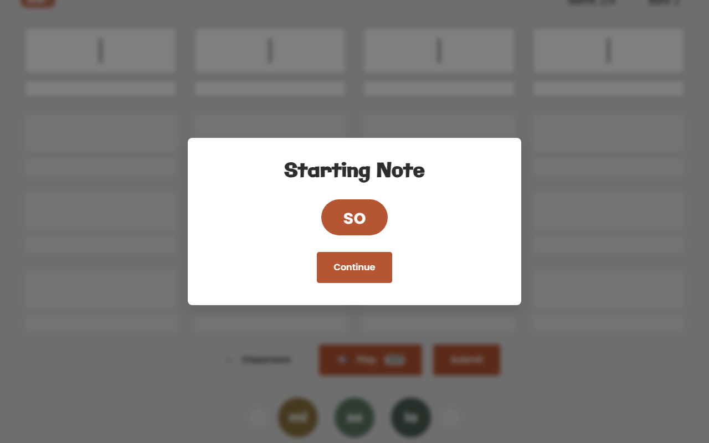
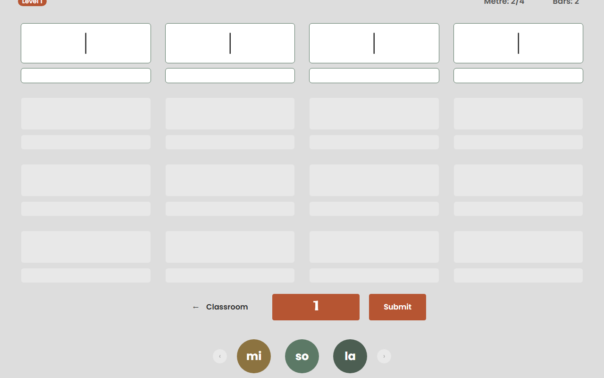
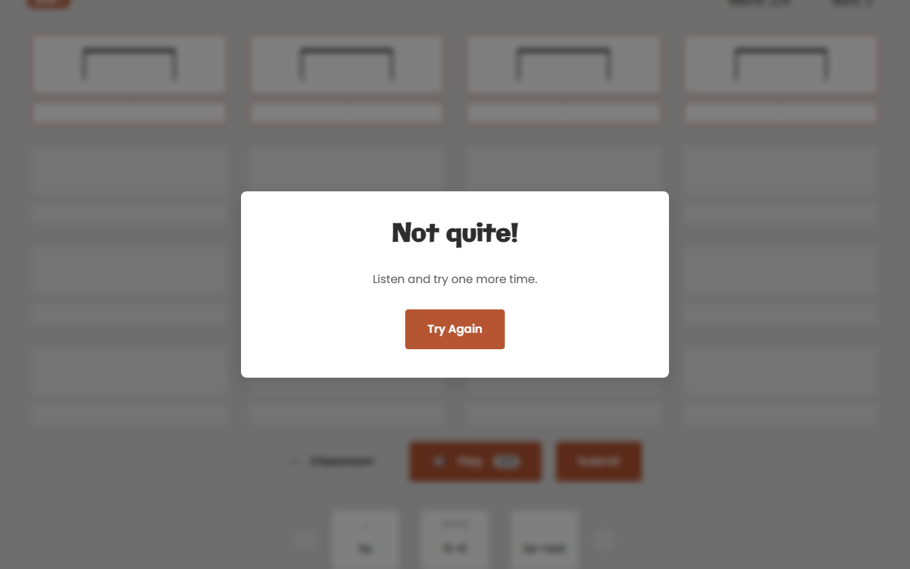
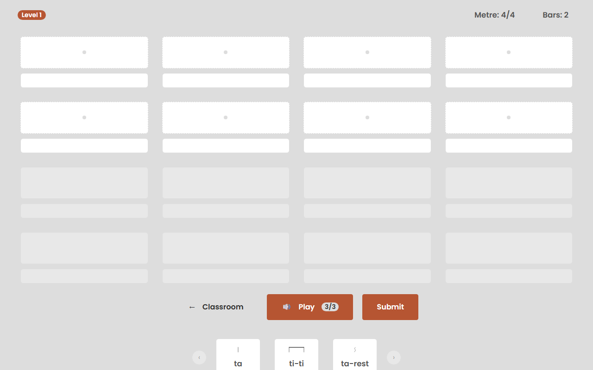
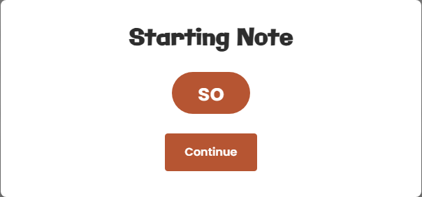
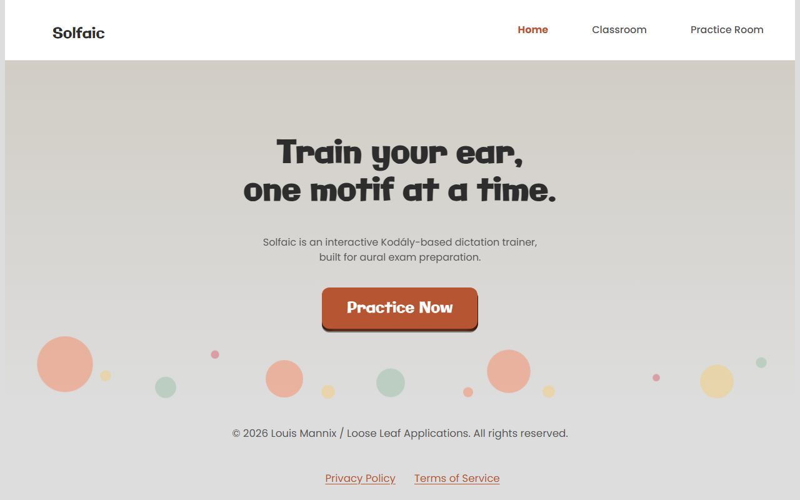
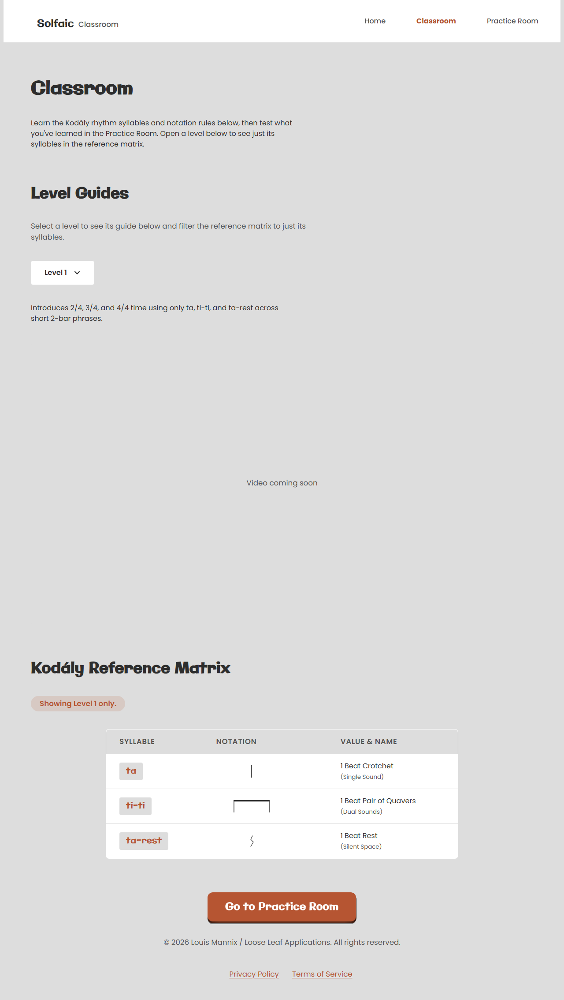

# Solfaic - Solfège Ear Trainer

[](https://github.com/StockoL/solfaic/blob/main/LICENSE)
[](https://github.com/StockoL/solfaic)
[](https://github.com/StockoL/solfaic)
[](https://github.com/StockoL/solfaic)
[](https://github.com/StockoL/solfaic)
[](https://github.com/StockoL/solfaic)

**<a href="https://stockol.github.io/solfaic/" target="_blank" rel="noopener noreferrer">🔴 LIVE APPLICATION: Click here to view the deployed site on GitHub Pages</a>**

Solfaic is an interactive web application designed to isolate and build rhythmic dictation and metric internalisation through a pedagogical progressive "ladder". It adheres to a core tenet of music theory education that a foundation in structural rhythm processing must be developed before pitch in the understanding of melody.

The underlying software architecture is intentionally decoupled and extensible, built as a standalone module ready to support a future Solfège pitch-training framework without structural rewrites.

---

## <a name="top"></a>📋 Table of Contents

1. [📖 Project Purpose & User Stories](#purpose)
2. [🔬 Strategic Research](#research)
3. [🖼️ UX Design Strategy (The 5 Planes)](#ux-strategy)
4. [🗺️ System Architecture & Logic Maps](#architecture)
5. [✨ Core Features & UI Overhauls](#features)
6. [🌐 Deployment Guide](#deployment)
7. [🤝 Credits & Acknowledgements](#credits)
8. [🏗️ Development Log & Engineering Phases](#dev-log)
9. [🧪 Testing & Quality Assurance Portfolio](#testing)

---

## 1. <a name="purpose"></a> 📖 Project Purpose & User Stories

### 1. The Examination/Audition Candidate

_Focus: Precision, pressure-testing, and structural success._

- **User Story:** As an aural examination applicant, I want to practise identifying rhythmic motifs and melodic solfège patterns within a structured progression so that I can build the metric accuracy required for my upcoming entrance test.
  - _Acceptance Criterion:_ The user is presented with generated exercises combining rhythm and pitch (movable-do), increasing in complexity across Levels 1–4, with the underlying curriculum data modelled through Level 9 for future implementation.

- **User Story:** As a music student, I want to receive immediate, specific diagnostic feedback when I submit an incorrect answer, so that I don't rehearse the wrong pattern into long-term memory.
  - _Acceptance Criterion (BDD):_ **Given** the user has submitted an incorrect rhythm or pitch sequence, **When** he system evaluates the response against the target, **Then** only the incorrect elements shake (not the whole board), and a diagnostic modal names the specific mistake — the rhythm to practise, or, for pitch errors, the actual interval that needs work, shown as the two notes involved.

- **User Story:** As a candidate simulating exam conditions, I want a strict, fresh limit on audio playbacks for each phase of an exercise, so that I rely on internal memory rather than continuous looping.
  - _Acceptance Criterion:_ Each exercise is dictated in two passes — rhythm, then solfège over the same confirmed rhythm — and each phase carries its own independent 3-play budget, not a shared one.

### 2. The Music Educator (The Facilitator)

_Focus: Pedagogy, motif-based learning, and consistency._

- **User Story:** As a music teacher, I want my students to practise with real pedagogical motifs — both rhythmic and melodic — rather than arbitrary generated content, so that training mirrors real repertoire and follows an authentic Kodály sequence.
  - _Acceptance Criterion:_ Rhythm and pitch content are drawn from curated motif/toneset libraries and combined using weighted Markov transition logic modelled on real melodic and rhythmic tendencies, not uniform randomness.

- **User Story:** As a teacher recommending a practice tool, I want the app to function cleanly across device sizes, so that students can train efficiently anywhere.
  - _Acceptance Criterion:_ The layout follows the CUBE CSS methodology (Composition, Utility, Block, Exception) — intrinsic layout primitives (Cluster, Switcher, Grid, Reel, Spread, and others) govern responsive behaviour without device-specific breakpoint hacks.

### 3. The Kodály Practitioner (Movable-Do Focus)

_Focus: developing genuine relative pitch through movable-do practice, independent of any single fixed key._

- **User Story:** As a self-directed learner without a teacher present, I want the app to teach me the Kodály solfège syllables and their relationships before testing me, so that I can build foundational knowledge independently.
  - _Acceptance Criterion:_ The Classroom page provides a reference matrix and per-level guides covering tonesets, intervals, and rhythm content, browsable independently of the Practice Room's testing environment.

- **User Story:** As a student developing relative pitch, I want each exercise generated in a randomly-chosen key, so that I learn to recognise pitch relationships rather than memorising fixed absolute pitches.
  - _Acceptance Criterion:_ No two consecutive exercises are guaranteed to share the same key — each resolves independently to one of a curated set of comfortable, singable starting pitches.

- **User Story:** As a learner distinguishing similar-sounding intervals, I want visual reinforcement of pitch relationships, so that colour becomes a secondary memory aid alongside my ear.
  - _Acceptance Criterion:_ Each solfège syllable is represented by its own distinct, consistent colour throughout the app, following the traditional convention of colour-coded solfège teaching.

### 4. The Accessibility-Conscious User

_Focus: legibility, keyboard operability, and assistive-technology compatibility as first-class requirements, not an afterthought._

- **User Story:** As a user relying on sufficient colour contrast, I want every text-bearing coloured surface — buttons, badges, links, solfège cards — to remain legible regardless of my vision.
  - _Acceptance Criterion:_ Every interactive colour meets WCAG AA's 4.5:1 minimum contrast standard against its paired text. Purely decorative elements, such as the homepage's background animation, are exempt by design, since no text is ever placed on top of them.

- **User Story:** As a keyboard-only user, I want every interactive element — modals, dropdowns, the level selector, the workspace — fully operable without a mouse.
  - _Acceptance Criterion:_ Every modal is fully dismissible and focus-trapped without a mouse, and every interactive element carries a consistent, visible focus state throughout the app.

- **User Story:** As a screen-reader user, I want page structure conveyed through real semantics, not purely visual cues, so that assistive technology can navigate the app accurately.
  - _Acceptance Criterion:_ Semantic HTML and ARIA labelling are used consistently across all interactive components.

<p align="right">(<a href="#top">Back to top</a>)</p>

## 2. <a name="research"></a>🔬 Strategic Research

### 1. Teoria (The Desktop Maestro)

- **The High Note (What works):** Excellent **Functional Patterns** for customisation. Allowing users to "register" their own practice session (intervals vs scales) mirrors how a choir director selects a specific warm-up.
- **The Flat Note (What fails):** Poor **Intrinsic Responsiveness**. It lacks the **Axioms of Layout** required for modern web apps — specifically, it doesn't handle the "narrow context" of mobile viewports well, leading to a fragmented user experience.
- **Innovation:** The Switcher pattern this inspired is now one of ten intrinsic layout primitives in Solfaic's full CUBE Compositions library, rather than a single borrowed technique — selection pads still cascade from wide desktop columns to thumb-friendly mobile blocks with zero device-specific breakpoints.

### 2. freeCodeCamp Drum Machine (The Audio Interface Scaffolding)

- **The High Note (What works):** Exceptional structural blueprint for mapping client-side interactive buttons to instantaneous audio sampler buffer responses and tracking active UI states cleanly.
- **The Flat Note (What fails):** Entirely reactive architecture; it lacks any system for scheduled timing grids, automated timeline sequence loops, or objective entry validation.
- **Innovation:** Solfaic isolates the interactive audio pad mechanism of a drum machine but steps it up into a Scheduled Timeline Matrix — now extended beyond rhythm alone to resolve real pitches via movable-do, feeding a dual rhythm-and-pitch timeline into deterministic evaluation processors.

### 3. LooseLeaf-ui (Prior Personal Design System)

- **The High Note (What works):** A pre-existing, dependency-free CUBE CSS starter system, already built with a working JSON-to-CSS token pipeline and a reusable library of layout compositions and visual blocks.
- **The Flat Note (What fails):** Generic component naming and default token semantics didn't transfer directly — surface-base, for instance, meant "a component's own background" in the source system but needed to mean "the page background" in Solfaic's specific token structure, and several default values (a placeholder blue/purple palette) needed replacing with Solfaic's actual brand.
- **Innovation:** Adapted rather than adopted wholesale — the same architecture and pipeline, with every token and component selector reconciled against Solfaic's specific palette, semantics, and DOM structure before use.

### 4. Andy Bell's CUBE CSS Methodology

- **The High Note (What works):** Resolves the "utility-first vs. semantic CSS" debate by cleanly separating macro-layout (Composition) from visual identity (Block), keeping cascade specificity flat via native CSS layers rather than specificity wars.
- **The Flat Note (What fails):** Doesn't prescribe what to do when no existing layout primitive genuinely fits a project-specific need.
- **Innovation:** Where a real gap existed — a header needing space-between behaviour no existing primitive provided, a workspace grid needing fixed-size rather than stretching columns — a new primitive or dedicated component was added rather than forcing an ill-fitting one to stretch to cover it.

### 5. Phoenix Collective / British Kodály Academy Musicianship Syllabus (Cyrilla Rowsell)

- **The High Note (What works):** A real, professionally-authored progression across 10 levels, giving the melodic engine genuine pedagogical grounding instead of an invented difficulty curve.
- **The Flat Note (What fails):** Written for live teaching — staff notation, ensemble singing, improvisation, work with a piano partner — most of which has no equivalent in an automated, solo dictation engine.
- **Innovation:** Only the generative content — tonesets, cadence targets, rhythm vocabulary, metres — was extracted from the syllabus and modelled as structured data (weighted tonesets and Markov transition tables), deliberately excluding everything that isn't reducible to "generate it, then have the student identify it."

<p align="right">(<a href="#top">Back to top</a>)</p>

## 3. <a name="ux-strategy"></a> 🖼️ UX Design Strategy (The 5 Planes)

### Initial Wireframes

<details>
<summary><b>🔍 Expand Initial UI Wireframes</b></summary>


</details>

### I. Strategy

- **User Goals:** To master both rhythmic and melodic (movable-do) dictation through an interactive, step-by-step training workspace, spanning a full pedagogical curriculum grounded in a real Kodály syllabus rather than an invented difficulty curve.
- **Target Audience:** Practical music candidates, choral applicants, and contemporary musicians formalising their aural perception — unchanged from V1's original framing, which held up.
- **The Future Runway:** V1 pre-wired a `pitch: null` field into its data model speculatively, betting the architecture could absorb a future melodic layer without a rewrite. That bet paid off — V2's melodic engine was built directly onto the existing rhythm engine's Markov-chain architecture rather than requiring a parallel system. The new forward-looking bet: Levels 1–4's full pentatonic/diatonic content is live and tested; Levels 5–9's curriculum data (modes, chromatic alteration, modulation) is already modelled, with the generation algorithms for that content deliberately deferred as a distinct future phase rather than attempted prematurely alongside everything else.

### II. Scope

- **Dual-Engine Algorithmic Synthesis:** Rhythm and pitch are generated independently, each from its own curriculum-grounded, weighted Markov transition system, then combined into one coherent sung-and-tapped exercise.
- **Movable-Do Resolution Layer:** Generation itself stays key-agnostic — exercises are produced as relative solfège tokens, with a randomly-chosen tonic resolving them to real, audible pitches only at playback time, training relative rather than absolute pitch recognition.
- **Escalating Diagnostic Evaluation:** Feedback isn't binary correct/incorrect — a graduated sequence runs from a targeted shake on just the wrong elements, to a "listen and try again" prompt with the streak left intact, to phase-specific remediation that names exactly what needs practice.
- **Session-Only Memory Profile:** Progression, scores, and streaks remain entirely client-side, with no backend or database dependency — unchanged from V1.

### III. Structure

- **Multi-Page Information Architecture:** V1's single-page application is now three purpose-built pages — Home (orientation), Classroom (learning the curriculum before testing), and Practice Room (the dictation engine itself) — replacing a single overloaded view with a deliberate learn-then-test flow. Classroom's level selector filters _which curriculum content is being browsed_ (the reference matrix, the level guides); it has no connection to the active practice session — Practice Room's level is never manually selected.
- **Two-Phase Exercise Resolution:** Each exercise is dictated once and answered twice — rhythm first, then solfège layered over the same confirmed rhythm — rather than treated as two separate listening events.
- **The Audio Signal Chain, extended:** V1's count-in-then-playback sequence now includes a movable-do resolution step between generation and sound, plus a dedicated starting-note cue at the rhythm-to-pitch transition, giving the student a stable reference pitch before the second phase begins.

### IV. Skeleton

- **CUBE Compositions as the Layout Vocabulary:** V1's informal borrowing from Every Layout is now a full, named Composition library — Cluster, Spread, Switcher, Grid, Reel, Container, Wrapper, Center, Sidebar, and Flow — each with a specific, non-overlapping structural job, composed together on the same elements rather than reached for ad hoc.
- **The Practice Room Workspace:** A metre-aware grid (column count follows the exercise's actual time signature rather than a fixed layout), paginated for longer phrases, where each box holds a rhythm card paired with its own solfège entry card beneath it.
- **Navigation Skeleton:** Consistent nav and footer chrome across Home and Classroom; the Practice Room deliberately strips this away entirely in favour of a thin, focus-mode header, protecting concentration during an actual exercise.

### V. Surface

- **New Typeface Pairing:** Galindo for display and heading type, Poppins for body copy — a deliberate rebrand from V1's unspecified system font stack.
- **A Two-Tier, Verified-Accessible Colour System:** Where V1 asserted an "AAA-accessible high-contrast schema," V2's palette is built on an explicit two-tier structure — bright, decorative-only tokens for illustration, and separately-derived, WCAG-verified "deep" variants for anything carrying text — with every text-bearing colour's contrast ratio computed and documented, not chosen by eye.
- **Colour-Coded Solfège:** Each syllable is rendered in its own distinct, consistent colour, following the traditional convention of colour-coded solfège teaching — and, deliberately, several of those colours are the same tokens already used for the app's primary buttons and badges, so the palette reinforces brand identity rather than introducing a disconnected second system.

### Pedagogical Whimsy & Interaction Philosophy

V1's specific examples (confetti, frustration-shake) mostly carried forward conceptually but are joined by new V2-specific whimsy:

- **Colour-Coded Solfège Circles** turn an abstract pitch relationship into an immediate visual one.
- **A Tactile, Physical Primary CTA** - a Comeau-style 3D "pushable" button, reserved deliberately for once-per-page hero moments rather than applied everywhere, so the effect stays a moment of delight rather than becoming visual noise on frequently-clicked buttons like Submit.
- **An Ambient, Branded Hero Animation** — a particle field on the homepage, coloured from the same solfège palette used in the Practice Room, seeding the app's visual language before a student ever reaches an exercise.
- **Cinematic Confetti**, carried over from V1, now correctly layered so the celebration modal reads as sitting in front of the burst rather than beneath it.

<div align="center">
  <video src="https://github.com/user-attachments/assets/3823e572-a5a2-4273-bf77-cca81b71c1b0" autoplay loop muted playsinline aria-label="Short looping video demonstration of Solfaic workspace showing a successful notation submission triggering a canvas-wide 3D confetti downpour celebration." width="100%" style="max-width: 600px; border-radius: 8px; box-shadow: 0 4px 12px rgba(0,0,0,0.1);"></video>
</div>

- **Tactile Frustration Microgestures (Error Handling):** Attempting to submit an incomplete exercise causes the entire canvas row to execute an aggressive **horizontal frustration shake** (`is-shaking`), while empty slots flash with a **crimson halo pulse** (`is-empty-panic`).

<div align="center">
  <video src="https://github.com/user-attachments/assets/2f392455-8e18-492f-8009-d7da8a6000f1" autoplay loop muted playsinline aria-label="Short looping video demonstration of Solfaic workspace showing the horizonal frustration shake triggered by the user when the workspace is incomplete." width="100%" style="max-width: 600px; border-radius: 8px; box-shadow: 0 4px 12px rgba(0,0,0,0.1);"></video>
</div>

- **Touch-First Sensation Mapping:** Hover definitions are suppressed entirely on mobile to eliminate sticky layout scaling freezes. Touch inputs focus exclusively on the high-fidelity `:active` state, delivering a crisp, immediate touch-down spring compression feel (`scale(0.96)`) the precise millisecond a finger makes contact.

<p align="right">(<a href="#top">Back to top</a>)</p>

## 4. <a name="architecture"></a> 🗺️ System Architecture & Logic Maps

Solfaic V2 separates cleanly into two architectural halves: a **JavaScript engine layer** (rhythm generation, extended to melodic generation) and a **CUBE CSS presentation layer**, neither of which existed in this form in V1.

### The Dual-Engine State Machine

V1's single rhythm-only engine is now two parallel generative systems sharing one architecture:

- **The Rhythm Engine** generates a bar-by-bar timeline via weighted Markov transitions over a curated motif library, exactly as in V1, now extended with anacrusis (pickup-beat) support and irregular-metre grouping.
- **The Melodic Engine**, built directly onto the same architectural pattern rather than as a separate system, generates a parallel solfège line — its own curriculum-grounded, independently-namespaced Markov tables per level and tonal mode, with cadence-forcing genuinely disabled (not just weighted low) wherever a toneset is too sparse to have a real "correct" ending.

Both engines are deliberately key-agnostic at generation time — output is relative solfège tokens and rhythmic values, never absolute pitches, keeping the movable-do principle architectural rather than incidental.

### The CUBE CSS Architecture (New in V2)

Where V1 shipped a single `style.css`, V2's presentation layer is structured in four native CSS cascade layers, later layers always winning regardless of selector specificity:

```text
Reset  →  Global  →  Compositions  →  Blocks  →  Utilities
```

- **Global:** a JSON-driven design token pipeline (`design-tokens.json` → a Node compiler → generated `variables.css`) — colour, type, space, and motion values defined once and consumed everywhere, never hardcoded in component files.
- **Compositions:** ten intrinsic layout primitives (Cluster, Spread, Switcher, Grid, Reel, Container, Wrapper, Center, Sidebar, Flow) governing structure only — no colour, border, or typography ever lives here.
- **Blocks:** self-contained visual components (Button, Nav, Accordion, Modal, Badge, Level-Select), each composing freely with Compositions on the same element rather than duplicating layout logic.
- **Utilities:** single-purpose overrides (visually-hidden, text alignment, ambient animation helpers) sitting at the top of the cascade for deliberate, isolated exceptions.

### The Generative Pipeline (extended from V1's Movable-Do Bridge)

V1 speculatively pre-wired a `pitch: null` field into every timeline event without a resolution mechanism behind it. V2 completes that bridge:

1. **Generation** produces a rhythm timeline and a parallel pitch line independently, each honouring its own level-gated toneset/motif constraints.
2. **Resolution** happens only at playback — a randomly-chosen tonic (from a curated, comfortably-singable set) combines with each solfège token via a semitone-offset lookup table to produce real Tone.js note names, meaning the exact same generated exercise sounds in a different key nearly every time it's played.
3. **Rendering** derives every rhythm card's stick-notation SVG _and_ its paired solfège card's entry-column layout from the same source data (a motif's note-by-note duration weights) — guaranteeing the two cards' columns always align, for any motif, without hand-tuning two separate assets in sync.

### Asynchronous Timeline Synchronisation & Two-Phase Evaluation

Each exercise is dictated once and answered in two passes against the same audio — rhythm, then solfège layered over the confirmed rhythm — with independent play budgets and independent evaluation per phase. Evaluation itself is graduated rather than binary: a first incorrect submission shakes only the wrong elements and prompts a retry without affecting the streak; a second still-wrong submission on the same answer triggers phase-specific remediation — the correct rhythm shown directly, or for pitch, the actual interval (both notes, not just the wrong one) that needs practice.

```text
[ Curriculum Data ]                     [ Design Tokens (JSON) ]
        │                                        │
        ▼                                        ▼
┌────────────────────┐                  ┌─────────────────────────┐
│   RHYTHM ENGINE      │                 │    Token Compiler          │
│   (Markov, motifs,    │                │    → variables.css          │
│   anacrusis, metre)   │                └────────────┬────────────────┘
└──────────┬───────────┘                               │
           │                                           ▼
           ▼                                  ┌─────────────────────────┐
┌────────────────────┐                        │   CUBE Cascade Layers     │
│   MELODIC ENGINE      │                      │   Reset→Global→Comp→     │
│   (Markov, tonesets,   │                     │   Block→Utility            │
│   cadence logic)       │                     └────────────┬────────────────┘
└──────────┬───────────┘                                    │
           ▼                                                │
┌─────────────────────────────┐                             │
│   Movable-Do Resolution        │                           │
│   (tonic + semitone lookup)    │                           │
└──────────┬────────────────────┘                            │
           ▼                                                 │
┌─────────────────────────────┐                              │
│   Audio Engine (Tone.js)       │                            │
│   count-in → playback →         │                           │
│   beat-pulse events               │                         │
└──────────┬────────────────────┘                             │
           │                                                  │
           ▼                                                  ▼
┌───────────────────────────────────────────────────────────────────┐
│         Workspace Render (rhythm-notation.js + CUBE Blocks)          │
│    one weight table → SVG stick notation + solfège grid,             │
│    every element styled entirely through the Block layer above       │
└──────────────────────────────┬──────────────────────────────────────┘
                                ▼
                  ┌──────────────────────────────┐
                  │      User Interaction Loop      │
                  │   (reel selection → workspace     │
                  │   submission, rhythm then pitch)   │
                  └───────────────┬───────────────────┘
                                  ▼
                  ┌──────────────────────────────┐
                  │     Two-Phase Evaluation         │
                  │   graduated feedback per attempt   │
                  └───────────────┬───────────────────┘
                                  │
                ┌─────────────────┴──────────────────┐
                ▼                                      ▼
     [ Correct → next phase,               [ Wrong → targeted shake,
       or streak++ on full                    retry, then phase-specific
       completion ]                            remediation modal ]
```

<p align="right">(<a href="#top">Back to top</a>)</p>

## 5. <a name="features"></a> ✨ Core Features & UI Overhauls

### The Melodic Engine & Two-Phase Dictation

The headline addition in V2. Where V1 tested rhythm alone, every exercise is now dictated once and answered twice: the student identifies the rhythm first, and only once that's confirmed correct does the practice reel switch to solfège syllables, layered over the same audio the rhythm was drawn from — not a second, different exercise. Each phase carries its own independent play budget, and a dedicated "Starting Note" cue sounds at the transition, giving the student a stable reference pitch before pitch identification begins.



### Colour-Coded Solfège

Each solfège syllable renders as its own distinctly-coloured circular card — a real convention in colour-coded solfège teaching, not a decorative choice. Several of the seven colours deliberately reuse the same tokens already driving the app's primary buttons and badges, so the palette reinforces the app's existing visual identity rather than introducing a second, disconnected one.



### Escalating Diagnostic Feedback

V1 offered a single tier of feedback — correct or incorrect. V2 escalates: a first wrong submission shakes only the specific incorrect elements (not the whole board) and prompts a retry without touching the streak. A second wrong submission on the same answer triggers targeted remediation — the correct rhythm shown directly for a rhythm mistake, or, for a pitch mistake, both notes of the actual interval that needs practice, not just the wrong note in isolation.



### Metre-Aware, Self-Aligning Workspace

The workspace grid's column count now follows the exercise's actual time signature — a 3/4 exercise renders in genuine 3-column rows rather than being forced into a 4-column layout that split bars awkwardly across row boundaries. Every rhythm card's stick-notation SVG and its paired solfège entry card are generated from the same underlying duration data, guaranteeing their columns align for any motif without hand-tuning two separate assets to match.



### Movable-Do Playback

Generation itself never touches an absolute pitch — every exercise is produced as relative solfège tokens, and only resolved to a real, audible key at the moment of playback, via a randomly-selected tonic from a curated, comfortably-singable set. The same generated exercise structure will very rarely sound in the same key twice, training genuine relative pitch rather than memorised absolute recognition.



### A Rebuilt, Accessible Visual System

V1 claimed an "AAA-accessible high-contrast schema" without a documented basis for it. V2's palette is built on a verified two-tier structure instead — bright tokens reserved strictly for decoration (no text ever sits on them), and separately-derived "deep" variants for anything text-bearing, each individually checked against WCAG AA's 4.5:1 contrast minimum rather than chosen by eye. Full architectural detail is in Section 4; this is the user-facing result of that work.



### Three-Page Restructure

V1's single-page application is now three purpose-built pages — Home, Classroom, and Practice Room — replacing one overloaded view with a deliberate learn-then-test information architecture. The Practice Room specifically strips away all navigation chrome in favour of a thin, focus-mode header, protecting concentration during an actual exercise.



### Dual-Purpose Rest Cards & the Anacrusis Mechanism

Rather than building a separate mechanism for pickup notes, the anacrusis reuses the exact same rest-initial motif cards (`rest-ti`, `rest-tika`) that already exist as ordinary mid-phrase rhythm content. Mid-phrase, they're just a card like any other — silence for the first half of the beat, a note for the second. At the very start of a phrase, that identical shape _is_ a pickup note: the rest counts the student in, and the sounding note lands right on the threshold into bar one, which is exactly what a musical anacrusis is. No second feature was built; an existing card was simply given a second job. An anacrusis adds precisely one beat to the exercise, never a full bar — the underlying phrase form is untouched, only a single pickup beat is prepended ahead of it.

### One Source of Truth for Notation

Every rhythm card's stick-notation SVG and its paired solfège entry card are computed from the same input: a single per-motif table of relative note-duration weights. Column boundaries, stem positions, and beam groupings are all derived proportionally from that one table — meaning the rhythm card's third stem and the solfège card's third entry column are guaranteed to land in the same place, for _any_ motif, without two separately-authored assets ever needing to be hand-tuned into agreement. This was the fix for a real bug during development: tied motifs spanning two grid boxes (a dotted note whose sound continues into the next box) initially left the solfège card with no entry column at all in the continuation box, because nothing tracked which portion of a motif's duration belonged to which box. The fix generalised the whole rendering system rather than patching the one motif that exposed the problem.

### Workspace Pagination for Longer Phrases

An 8-bar exercise in a busy metre can generate more individual rhythm cards than comfortably fit on one screen. Rather than shrinking cards to force a fit, or truncating longer phrases, the workspace paginates horizontally — dot navigation moves between pages of the same exercise, keeping every card at a consistent, legible size regardless of how long the underlying phrase is.

### Tap-and-Hold Focus Editing

Selecting the correct card from a scrolling reel on a small touchscreen is a fundamentally different interaction problem than doing it with a mouse. Tap-and-hold on any workspace card opens a focused "vignette" view — the single card enlarged, with its own mirrored reel for making a selection up close — before returning to the full board. A deliberate second interaction mode for a problem that a single, one-size-fits-all interface handles poorly.

### Irregular Metres Without a Second Generator

5/8 and 7/8 don't divide into equal beats, so they're conventionally grouped — 2+3, or 2+2+3 — rather than treated as a flat tick count. Rather than building a dedicated irregular-metre generator, each group in the pattern is simply one more call to the existing bar generator: a "2" group is exactly one simple-time beat's worth of content, a "3" group is exactly one compound-time beat's worth, and both pools of content already existed. Architectural economy over building a parallel system for what turned out to be the same underlying problem at a smaller scale.

### Deliberately Unforced Cadence Logic

V1's own stated pedagogical principle — real motifs from curated pools, not arbitrary randomness — extends into a specific, deliberate constraint on the melodic engine: sparse early tonesets (a two-note so-mi exercise, for instance) are _not_ forced to resolve onto a "correct" final note. Real early-repertoire songs built from just two or three notes don't reliably end the same way, because there isn't yet a strong enough tonal centre established to make one ending more "correct" than another — forcing a resolution rule onto content that thin would have been mathematically tidy and musically dishonest. Cadence-forcing only activates once a level's toneset is rich enough to genuinely support the concept of a tonic.

### Mastery-Gated Progression

Practice Room has no level switcher of its own — a session always begins at Level 1, and advancing to the next level happens only by completing three exercises correctly in a row, surfaced through the celebration modal. This is a deliberate constraint, not a missing feature: it prevents a student from skipping ahead to content they haven't actually demonstrated mastery of. Classroom's level dropdown is a separate, unrelated control — it filters which level's curriculum guide and reference-matrix rows are currently being viewed, with no effect on the active practice session at all.

<p align="right">(<a href="#top">Back to top</a>)</p>

## 6. <a name="deployment"></a> 🌐 Deployment Guide

This project was developed using Git version control and is hosted on GitHub. It has been deployed as a live web application using **GitHub Pages**.

### Build Step (New in Version 2)

Unlike V1's single static stylesheet, V2's CSS is generated from a token pipeline and **will not render correctly if this step is skipped** — every colour, spacing, and typography value in the compiled `variables.css` depends on it.

1. **Install dependencies:** `npm install` (Node.js required — this is now a genuine prerequisite, not just a convenience option for local serving).
2. **Compile the design tokens:** `npm run build:tokens`. This reads `design-tokens.json` and generates `src/css/global/variables.css`. Re-run this any time `design-tokens.json` changes — the generated file is never hand-edited directly.

### Deployment Steps

To deploy the site to GitHub Pages:

1. **Repository Access:** Click on the Settings tab located in the repository's main navigation bar.
2. **Pages Configuration:** In the left-hand sidebar, click on **Pages**.
3. **Source Selection:** Ensure the "Source" dropdown is set to **Deploy from a branch**.
4. **Branch Targeting:** Select the `main` branch, folder set to `/ (root)`.
5. **Save & Build:** Click **Save** to trigger the GitHub Actions build workflow.
6. **Live Link:** Appears at the top of the settings page after a few minutes.

Note: the compiled `variables.css` should be committed to the repository (not generated on the fly by GitHub Pages, which doesn't run a build step) — run the build step locally and commit the output before pushing.

### Local Deployment (Cloning)

1. Navigate to the GitHub repository and click the green `<> Code` button to copy the HTTPS URL.
2. Open your terminal and run: git clone `https://github.com/StockoL/solfaic.git`
3. Run the **Build Step** above (`npm install`, then `npm run build:tokens`) before doing anything else.
4. Serve the project through a real local server — **this is no longer optional for a second, more fundamental reason than V1's Web Audio permissions requirement.** V2's JavaScript is loaded via ES modules (`<script type="module">`), which fail outright over the `file://` protocol regardless of audio permissions. Opening `index.html` by double-clicking it will not work at all.

### ⚡ Quick Local Spin-Up Alternatives

From the cloned root directory, after completing the Build Step above:

- **Node.js (via npx):** `npx static-server` or `npx http-server`
- **Python 3.x:** `python -m http.server 8000`
- **VS Code:** the Live Server extension remains the simplest option for active development

<p align="right">(<a href="#top">Back to top</a>)</p>

## 7. <a name="credits"></a> 🤝 Credits & Acknowledgements

- **Tone.js (v14):** External framework used to script the transport sequence engine scheduler, now driving both rhythm playback and movable-do pitch resolution.
- **Josh Comeau ("Whimsical Animations" Course):** Directly inspired the confetti celebration and pushable CTA button's spring physics — deliberately reserved for once-per-page hero moments in V2, rather than applied throughout.
- **Andy Bell (CUBE CSS Methodology):** The architectural foundation for the entire V2 presentation layer — Composition, Utility, Block, Exception, and native CSS cascade layers replacing V1's single stylesheet.
- **LooseLeaf-ui (Prior Personal Design System):** The source library for V2's Compositions and several Blocks, adapted to Solfaic's specific tokens, semantics, and DOM structure rather than used verbatim.
- **Every Layout (Heydon Pickering):** Principles of intrinsic web design that originally informed V1's layout thinking, and which LooseLeaf-ui's own Compositions are themselves built on — a lineage carried forward into V2 rather than a direct source this time.
- **Utopia.fyi:** Generated the fluid type and space scales driving V2's entire typography and spacing system.
- **Phoenix Collective (Cyrilla Rowsell) / British Kodály Academy:** Source curriculum for the melodic engine's tonesets, cadence logic, and rhythm vocabulary across all 9 modelled levels — the pedagogical backbone of the entire melodic system.
- **Google Fonts (Galindo, Poppins):** V2's typeface pairing, replacing V1's unspecified system font stack.

Licensed under the [MIT License](./LICENSE).

### AI Pair Programming & Academic Integrity

Artificial Intelligence (LLMs) was utilised strictly as a "Pair Programmer" and strict linter throughout the development lifecycle to accelerate cross-browser debugging, reflow profiling, and formatting, ensuring absolute human ownership and comprehension of the overarching engine code.

### Technologies Used

- **HTML5:** Semantic, accessible markup across three purpose-built pages.
- **CSS3:** Custom properties, CSS Grid, native cascade layers (`@layer`), and `color-mix()` for the accessible palette derivation.
- **JavaScript (ES6+ Modules):** A dual-engine (rhythm + melodic) generative architecture with a fully separated state/view/engine structure.
- **Tone.js (v14):** Web Audio API synthesis and scheduling, extended for movable-do pitch resolution.
- **Node.js:** Powers the design-token compiler (`design-tokens.json` → `variables.css`).
- **Inline SVG:** Rhythm notation and solfège entry columns generated programmatically from shared duration data, rather than hand-authored per motif.
- **Git & GitHub:** Atomic commit history and cloud distribution.

### 📂 Repository Structural Layout

```text
├── .github/workflows/         # CI — runs the Playwright suite on push
├── LICENSE                     # MIT
├── design-tokens.json         # Single Source of Truth — colour, type, space, motion tokens
├── build-tokens.js            # Token compiler (Vanilla Node.js)
├── package.json                # Build & test commands (build:tokens, verify:engine)
│
├── index.html                  # Home
├── classroom.html              # Classroom — curriculum reference & level guides
├── practice.html               # Practice Room — the dictation engine itself
├── 404.html                     # GitHub Pages fallback
│
├── docs/
│   ├── wireframes/             # Initial UI concepts
│   ├── architecturemaps/       # Early Mermaid flowcharts from initial project conception
│   ├── screenshots/             # UI captures referenced throughout this README
│   └── animations/              # Confetti / frustration-shake source clips
│
├── tests/
│   ├── engine-verification.mjs  # Node harness — pure-function engine checks (npm run verify:engine)
│   └── solfaic.spec.js           # Playwright E2E suite
├── playwright.config.js         # 3 browser/device projects (Desktop Chromium, Mobile Chrome, Mobile Safari)
│
└── src/
    ├── css/
    │   ├── index.css           # Orchestrator — declares the cascade layer order
    │   ├── global/              # Reset, base typography, auto-generated variables.css
    │   ├── compositions/        # 10 layout primitives (Cluster, Spread, Grid, Reel...)
    │   ├── blocks/               # Visual components (Button, Nav, Accordion, Modal...)
    │   └── utilities/            # Single-purpose overrides
    │
    └── js/
        ├── app.js                # Event wiring & bootstrap
        ├── core.js               # DOM rendering (view layer)
        ├── engine.js             # Rhythm + melodic generation (pure functions)
        ├── data.js               # Motif library, curriculum data, design tokens' JS counterpart
        ├── audio.js              # Tone.js playback, movable-do resolution
        ├── state.js              # Single source of truth for session state
        └── rhythm-notation.js    # Generates rhythm SVG + solfège columns from shared data
```

<p align="right">(<a href="#top">Back to top</a>)</p>

## 8. <a name="dev-log"></a>🏗️ Development Log & Engineering Phases

V2's build ran in five loosely sequential phases, each building directly on the last rather than as a flat feature list:

1. **Rhythm engine extension** — carrying V1's Markov-driven bar generator forward, then adding anacrusis (pickup-beat) support and irregular-metre grouping (5/8, 7/8) without a second, parallel generator.
2. **Melodic engine & the movable-do bridge** — a curriculum-grounded pitch generation layer built onto the same architectural pattern as the rhythm engine, plus the resolution step (`audio.js`) that turns relative solfège tokens into real, keyed notes only at playback time.
3. **CUBE CSS rebuild & the accessible palette rollout** — migrating from V1's single stylesheet to a four-layer cascade architecture, then auditing and darkening every text-bearing button/badge/status colour to a verified WCAG AA 4.5:1 minimum, while deliberately keeping the hero particle field and focus ring on the brighter, pre-darkened tokens.
4. **Two-phase workspace & shared notation rendering** — rebuilding the practice workspace around a metre-aware grid and a single shared duration table that drives both the rhythm SVG and the paired solfège entry columns, so the two never drift out of alignment.
5. **Test harness build-out** — a Node harness for the two pure-function engines (`tests/engine-verification.mjs`), followed by a full Playwright rewrite of the E2E suite to match the two-phase rhythm/pitch flow and the current page structure.

### Notable Bugs Caught & Fixed

**Tied motifs left the solfège card with no entry column in the continuation box**

- A motif tied across two grid boxes (a dotted note whose sound continues into the next box) had nothing tracking which portion of its duration belonged to which box, so the solfège card's continuation box rendered with no entry column at all.
- _Fix:_ Generalised the shared rendering system to track duration-per-box explicitly, rather than patching the one motif that exposed the gap.

**Palette darkening had fallout across three derived surfaces**

- Darkening `action-primary`/`action-secondary`/`status-success` for text contrast — the core accessibility fix — had knock-on effects nothing else caught automatically: the pushable CTA's `color-mix()`-derived shadow/edge layers collapsed into a muddy, low-contrast stack; the hero particle field silently inherited the new muted tone instead of staying decorative-bright; and the site-wide focus ring became noticeably less visible.
- _Fix:_ Restored the CTA's 3D depth against the new base colour, and pointed the hero particles and focus ring explicitly at the separate `accent-vivid-*` tokens reserved for decoration, leaving the deep tokens exclusively for text-bearing surfaces.

**Practice Room broke after a dead-code removal**

- Removing the unused V1 onboarding-tour wizard from `core.js` took a live module dependency down with it, breaking Practice Room's boot sequence.
- _Fix:_ Restored the load path without reintroducing the dead tour code.

**Confetti and the celebration modal fought over stacking order**

- The confetti burst originally rendered in front of the celebration modal instead of behind it, and the modal backdrop dimmed the confetti's own colours.
- _Fix:_ Corrected the layering so the modal reads as sitting in front of the burst, with the confetti kept fully coloured.

**The workspace grid didn't follow the exercise's actual metre**

- Early workspace layouts used a fixed column count, splitting bars awkwardly across row boundaries for anything other than common time.
- _Fix:_ Column count is now derived from the live session's `ticksPerBar`, so a 3/4 exercise renders in genuine 3-column rows.

<p align="right">(<a href="#top">Back to top</a>)</p>

## 9. <a name="testing"></a> 🧪 Testing & Quality Assurance Portfolio

This section outlines the holistic verification suite executed to guarantee the engineering integrity, mathematical precision, and cross-platform accessibility of Solfaic.

### 1. Engine Verification (Node Harness)

The rhythm and melodic engines are pure functions with no DOM dependency, so they're verified independently of the browser via a lightweight Node harness (`tests/engine-verification.mjs`) rather than routed entirely through slower, flakier E2E tests. This is where the genuinely new V2 logic — anacrusis gating, cadence-forcing behavior, movable-do resolution — is actually checked, not just exercised incidentally through UI clicks.

- `MOTIF_LIBRARY` **internal consistency:** every motif's `playback` array sums to its declared `ticks` value in quarter-note-equivalent beats, and every `restMask` (where present) matches its `playback` array's length. Catches a motif definition being silently wrong before it ever reaches generation.
- **Rhythm generation, 200 trials per level:** confirms every generated motif is drawn from that level's allowed pool, totalTicks correctly accounts for an anacrusis pickup beat when present, anacrusis-gated levels see it appear probabilistically (neither always nor never), and cadence-enforced levels genuinely end on a CADENCE_MOTIFS member.
- **Irregular metre grouping (5/8, 7/8):** confirms both the default and contrasting-variant groupings sum to valid tick totals — standalone-verified ahead of being wired into a live level.
- **Pitch generation, 200 trials per level:** confirms generated pitch lines stay inside the active toneset, tonics are drawn from the allowed set, and — critically — Level 1's final note varies meaningfully across trials rather than clustering on one value, confirming cadence-forcing is genuinely disabled there, not just weighted low.
- `countSoundingNotes` ↔ `generatePitchLine` pairing, 100 trials: confirms the pitch line's length always matches the rhythm timeline's actual sounding-note count, `restMask`-aware, across all four playable levels.
- `resolveSolfegeToNote`: confirmed against 6 known solfège-token/tonic pairs, plus a full accounting check on `SOLFEGE_DEGREES` (14 syllables: 7 diatonic, upper `do'`, and 6 chromatic alterations).
- **Sample phrase printout:** 5 generated rhythm+pitch phrases per level logged in full, for a human legibility check numbers alone can't provide — does a generated Level 2 phrase actually look like something a Level 2 student would plausibly be asked to sing?

### 2. Automated End-to-End Testing (Playwright)

Runs across three browser/device configurations — Desktop Chromium, Mobile Chrome (Pixel 5 viewport), and Mobile Safari (iPhone 12 viewport, WebKit engine) — via `playwright.config.js`, continuing V1's original commitment to verifying the responsive "Sponge" layout actually holds up under real engine differences, not just Chromium alone.

- **A note on testing generative UI:** rhythm and pitch generation draw from `Math.random()` at every step, so the exercise a test needs to solve correctly is normally unknowable from outside the page. The suite solves this by forcing `Math.random` to a constant via `page.addInitScript()` before navigation — every "random" draw becomes reproducible, so re-invoking the same generator function reveals the exact target the live page is already holding, without needing to inspect or mock internal state directly.
- **Initialization & UI Routing:** confirms Practice Room boots to Level 1 defaults with a populated reel; confirms the level dropdown, now relocated to Classroom, correctly filters both the level guide and the reference-matrix table to a single level's content.
- **Input & Interaction Mechanics:** motif pad clicks fill the next open slot; number-key shortcuts and Backspace correctly inject and clear motifs.
- **Validation & Error Workflows:** an incomplete board triggers the empty-panic shake; a complete submission runs evaluation, with feedback landing as a `data-feedback` attribute on the workspace box (updated from an earlier class-based approach, following the two-phase rhythm/pitch rework).
- **Audio Context & Thread Locking:** playback correctly locks the replay button against double-firing.
- **Two-Phase Rhythm → Pitch Flow:** a correct rhythm submission triggers the Starting Note modal, swaps the reel from rhythm motifs to solfège syllables, and leaves the confirmed rhythm boxes visible but read-only while the pitch phase is worked.
- **Escalating Feedback & Remediation:** a first wrong submission shows the "Try Again" modal without disturbing the streak; a second wrong submission on the same still-incorrect board names what to practise, reveals the correct answer on the board, and resets the exercise.
- **Solfège Card Colours:** every reachable syllable resolves to a real, non-empty colour, and no two syllables active in the same toneset ever share one — confirming the palette reads as genuinely distinguishable, not verified by contrast math alone.
- **Metre-Aware Workspace Grid:** the grid's actual column count is re-derived independently from the live session's `ticksPerBar` and compared against the page's rendered `--grid-placement`, confirming bars pack multiple-per-row where they fit rather than always reserving one row per bar.

### 3. Manual Testing Matrix (Outstanding — to complete before project close)

Covers what automated coverage structurally can't: genuine human/perceptual judgment, real (not emulated) devices, and assistive technology actually in use rather than semantic HTML presence alone. Template below — statuses are placeholders, not results, until each row is actually run.

| ID    | Target                                     | Steps                                                                                                  | Expected Result                                                                                                                    | Actual Result | Status    |
| ----- | ------------------------------------------ | ------------------------------------------------------------------------------------------------------ | ---------------------------------------------------------------------------------------------------------------------------------- | ------------- | --------- |
| MT-01 | Audio quality & timing perception          | Play several exercises across all 4 metres on real hardware (not emulated)                             | Count-in, playback, and the starting-note cue all sound rhythmically accurate and audibly clean, no perceptible latency            | —             | ☐ Pending |
| MT-02 | Screen reader navigation                   | Navigate a full two-phase exercise (rhythm submit → pitch phase → submit) using VoiceOver or NVDA only | Every state change (phase transition, modal open/close, success/error) is announced; no silent or confusing state                  | —             | ☐ Pending |
| MT-03 | Colour-blind safety of the solfège palette | View the reel under Deuteranopia/Protanopia simulation (browser extension or OS-level filter)          | All syllables present in a given toneset remain visually distinguishable from each other, not just individually contrast-compliant | —             | ☐ Pending |
| MT-04 | Real touch responsiveness                  | Use the reel and workspace on an actual touchscreen device (not Playwright's emulated tap)             | Drag/tap/scroll on the reel and vignette feel immediate, no missed or double-registered touches                                    | —             | ☐ Pending |
| MT-05 | Extended session stability                 | Complete 15–20 consecutive exercises in one sitting without reloading                                  | No perceptible slowdown, memory growth, or audio glitching by the end of the session                                               | —             | ☐ Pending |
| MT-06 | Cross-tonic audio correctness              | Manually trigger playback across a wider tonic sample than the engine harness's 6 spot-checked cases   | No audibly wrong note anywhere in the `allowedTonics` set, including enharmonic spelling edge cases                                | —             | ☐ Pending |
| MT-07 | Genuine physical-device rendering          | Load the app on at least one real iOS and one real Android device                                      | Layout, fonts, and animation match desktop/emulated behaviour; no device-specific rendering bugs                                   | —             | ☐ Pending |

### 4. Lighthouse Scores (Outstanding)

Not yet re-run against V2. V1's scores (98/100/100/100) was a single-page app with a single stylesheet and are not carried forward here, since they don't describe the current three-page, token-driven build. Placeholder table, to fill in per page once run:

| Page             | Performance | Accessibility | Best Practices | SEO |
| ---------------- | ----------- | ------------- | -------------- | --- |
| `index.html`     | —           | —             | —              | —   |
| `classroom.html` | —           | —             | —              | —   |
| `practice.html`  | —           | —             | —              | —   |

### 5. Browser Compatibility (Outstanding — beyond Playwright's automated coverage)

Playwright's Mobile Safari project runs the WebKit _engine_, not physical Safari on physical iOS — genuine device/browser-specific quirks (V1's own testing log found a real one: Safari's collapsing bottom toolbar interacting badly with `100dvh`) won't necessarily surface through emulation alone. Manual pass still needed:

| Engine / Browser                     | Verified | Notes     |
| ------------------------------------ | -------- | --------- |
| Chromium (Chrome/Edge desktop)       | —        | ☐ Pending |
| WebKit (Safari desktop)              | —        | ☐ Pending |
| WebKit (Safari iOS, physical device) | —        | ☐ Pending |
| Gecko (Firefox)                      | —        | ☐ Pending |

### 6. Validator Testing (Outstanding)

| Validator                   | Result | Notes                                       |
| --------------------------- | ------ | ------------------------------------------- |
| W3C HTML Validator          | —      | ☐ Pending — check all 3 pages independently |
| W3C CSS Validator           | —      | ☐ Pending                                   |
| ESLint / JS static analysis | —      | ☐ Pending                                   |

### Known Issues

- **Tone.js Cold-Start Lag:** On older mobile processors, the very first note triggered after initialisation can occasionally experience a ~50ms audio latency spike as the browser compiles the Web Audio API oscillator nodes. Subsequent playbacks run entirely in real-time.
- **Anacrusis-affected exercises may under-size the submission board:** `app.js`'s `startLevel()` sizes the answer board from `bars × ticksPerBar` rather than the generated exercise's actual `totalTicks`. Levels 3 and 4 can generate an anacrusis (pickup beat), which adds one tick the board doesn't currently budget for — worth verifying directly before those levels see wider use.

<p align="right">(<a href="#top">Back to top</a>)</p>
